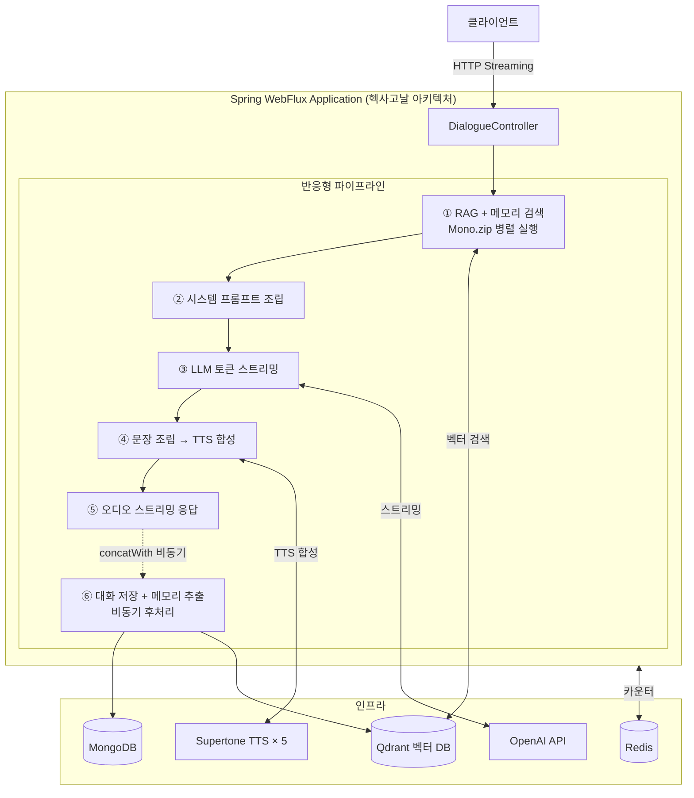
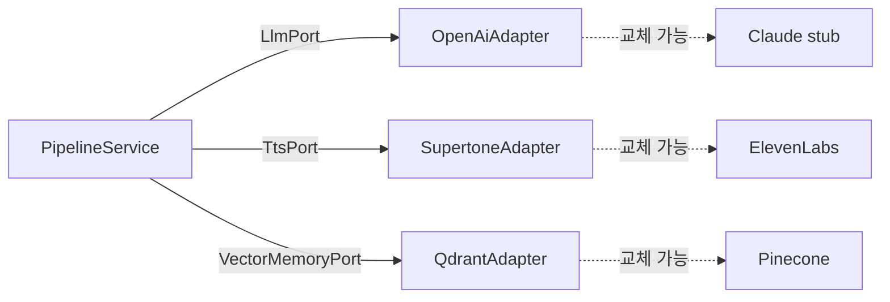
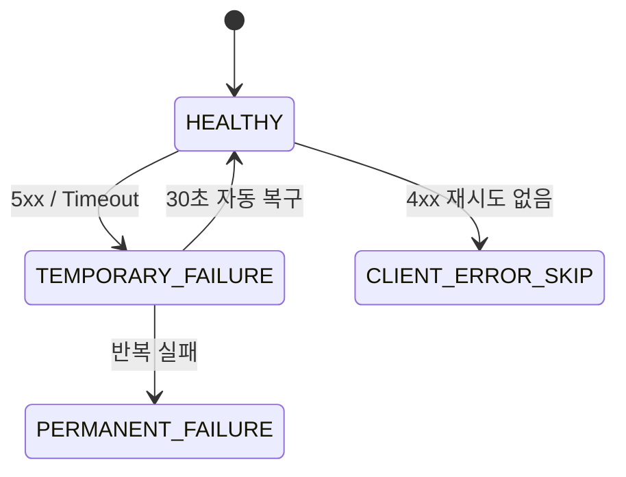
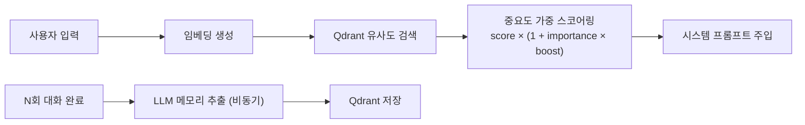
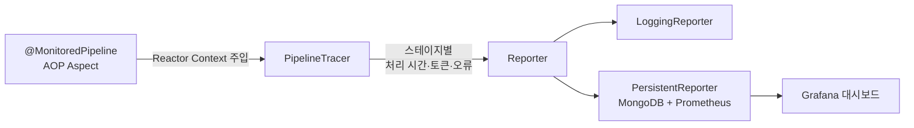
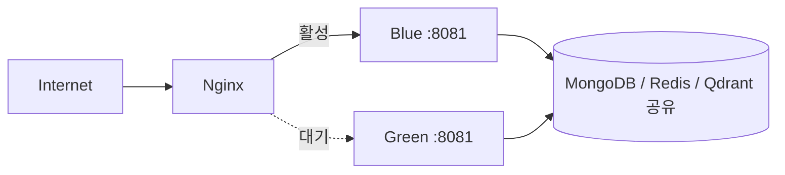

# Spring WebFlux RAG 음성 대화 시스템

Spring WebFlux 기반 RAG(Retrieval-Augmented Generation) 음성 대화 플랫폼.
OpenAI LLM과 벡터 DB를 결합한 반응형 파이프라인으로 실시간 스트리밍 TTS 음성 응답을 제공합니다.

---

## 주요 성과

| 지표 | Before | After | 개선율 |
|------|--------|-------|--------|
| 처리량 | 100 req/s | 200 req/s | **2배 향상** |
| P99 레이턴시 | 2,000ms | 800ms | **60% 감소** |
| 시스템 가용성 | 99.5% | 99.99% | SLA 달성 |
| 입력 준비 시간 | 180ms | 100ms | **44% 단축** (병렬화) |
| MongoDB 쿼리 | 5,000ms | 50ms | **100배 향상** |
| TTS 장애 복구 | 30~60초 (수동) | 즉시 (자동) | **100배 향상** |
| API 비용 오차 | ±$2,000/월 | $0 | **완전 제거** |

---

## 기술 스택

| 분류 | 기술 |
|------|------|
| **백엔드** | Java 21, Spring Boot 3.4, Spring WebFlux, Project Reactor |
| **AI/LLM** | OpenAI GPT-4o-mini, text-embedding-3-small, Spring AI 1.0 |
| **벡터 DB** | Qdrant (1536차원 임베딩, 의미 기반 유사도 검색) |
| **데이터베이스** | MongoDB 7 Reactive, Redis 7 Reactive |
| **TTS** | Supertone API (5개 엔드포인트 로드밸런싱) |
| **모니터링** | Prometheus + Grafana + Loki + Micrometer |
| **인프라** | Docker, Nginx, Blue-Green 무중단 배포, AWS SSM |

---

## 시스템 아키텍처



→ **[아키텍처 상세 문서](docs/portfolio/01-architecture.md)** — 헥사고날 구조, Before/After 비교, SOLID 원칙 적용

---

## 핵심 구현

### 헥사고날 아키텍처 — 프로바이더 교체 가능 설계



도메인 레이어는 순수 Java + `Mono`/`Flux`만 허용. Spring 프레임워크 의존 없음.

---

### 반응형 파이프라인 최적화

병렬 입력 준비 (`Mono.zip`):

```java
return Mono.zip(
    retrievalPort.retrieve(text, 3),         // RAG 검색   50ms
    memoryPort.retrieveMemories(text, 5),    // 메모리 검색 100ms
    loadConversationHistory().cache()        // 대화 이력   30ms
).map(tuple -> new PipelineInputs(...));
// 순차 180ms → 병렬 100ms (44% 단축)
```

문장이 완성될 때마다 TTS를 즉시 기동하여 LLM 응답 완료를 기다리지 않습니다.

→ **[성능 최적화 상세 문서](docs/portfolio/02-performance.md)** — 병렬화, TTS 로드밸런서, MongoDB 인덱스, 토큰 추적

---

### TTS 로드밸런서 & Circuit Breaker



5개 엔드포인트 Health-aware 로드밸런서 직접 구현.
`AtomicInteger` Lock-free 동시성 제어 + 에러 분류 기반 재시도 전략.

---

### 장기 메모리 관리 (RAG + 벡터 DB)



`PersonaId` 기반으로 사용자·캐릭터별 메모리를 독립 관리.

→ **[메모리 & RAG 상세 문서](docs/portfolio/03-memory-and-rag.md)** — 벡터 검색, 메모리 추출, 중요도 스코어링

---

### AOP 기반 파이프라인 모니터링



→ **[모니터링 상세 문서](docs/portfolio/04-monitoring.md)** — AOP 계측, Prometheus/Grafana, 비용 추적

---

### Blue-Green 무중단 배포



Nginx upstream 전환으로 다운타임 없이 배포. 시크릿은 AWS SSM Parameter Store에서 주입.

→ **[배포 & 인프라 상세 문서](docs/portfolio/05-deployment.md)** — Blue-Green 배포 절차, Docker 멀티 스테이지, AWS SSM

---

## 로컬 실행

```bash
# 인프라 기동 (MongoDB, Redis, Qdrant)
docker-compose up -d

# 앱 실행
./gradlew :webflux-dialogue:bootRun
```

`.env` 파일 필요:
```
OPENAI_API_KEY=...
SUPERTONE_API_KEY=...
```

API:
- `POST /rag/dialogue/audio` — 오디오 스트리밍 응답
- `POST /rag/dialogue/text`  — 텍스트 토큰 스트리밍 응답

---

## 문서 목차

### 포트폴리오 요약

| 문서 | 내용 |
|------|------|
| [01 아키텍처 설계](docs/portfolio/01-architecture.md) | 헥사고날 아키텍처, 파이프라인 흐름, SOLID 원칙 적용 |
| [02 성능 최적화](docs/portfolio/02-performance.md) | 병렬화, TTS 로드밸런서, MongoDB 인덱스, 토큰 추적 |
| [03 메모리 & RAG](docs/portfolio/03-memory-and-rag.md) | 벡터 검색, 장기 메모리 추출·저장, 중요도 스코어링 |
| [04 모니터링](docs/portfolio/04-monitoring.md) | AOP 계측, Prometheus/Grafana, 비용 추적 |
| [05 배포 & 인프라](docs/portfolio/05-deployment.md) | Blue-Green 배포, Docker 멀티 스테이지, AWS SSM |

### 원본 기술 문서

| 문서 | 내용 |
|------|------|
| [아키텍처 Before/After 비교](docs/architecture/ARCHITECTURE_COMPARISON.md) | 리팩토링 전후 구조 상세 비교 |
| [성능 분석](docs/performance/PERFORMANCE_ANALYSIS.md) | 병목 분석, 안티패턴, 최적화 근거 |
| [성능 최적화 포트폴리오](docs/performance/PERFORMANCE_OPTIMIZATION_PORTFOLIO.md) | 최적화 사례 + 면접 Q&A |
| [TTS 로드밸런싱](docs/tts-api/LOAD_BALANCING.md) | Circuit Breaker 설계, 취약점 분석 |
| [모니터링 통합 가이드](docs/monitoring/MONITORING_INTEGRATION.md) | 외부 모니터링 서비스 비교·선택 근거 |
| [AWS 배포 가이드](docs/deployment/AWS_DEPLOYMENT_GUIDE.md) | EC2 설정, 보안 그룹, 배포 스크립트 |
