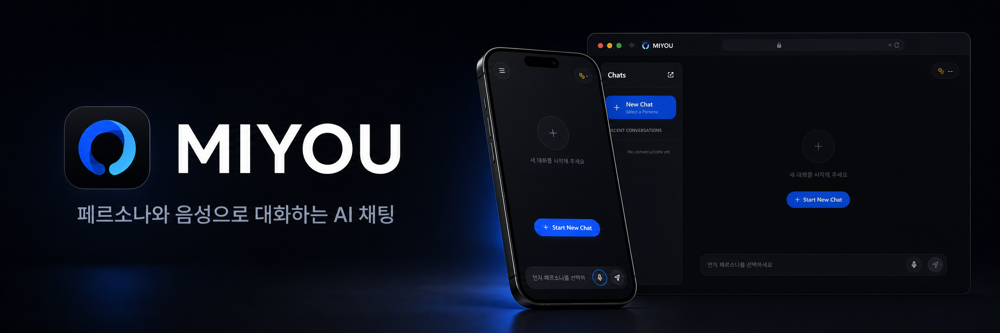
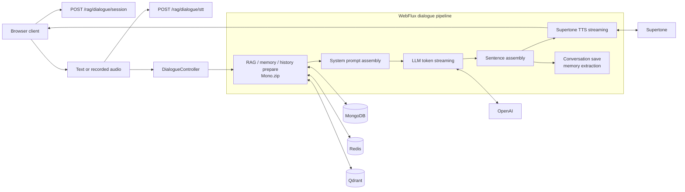

# MIYOU

페르소나와 음성으로 대화하는 AI voice chat 서비스입니다.

MIYOU는 사용자가 캐릭터나 면접관 같은 페르소나를 선택하고, 텍스트 또는 음성으로 대화할 수 있는 한국어 AI 대화 애플리케이션입니다. 백엔드는 Spring WebFlux 기반 스트리밍 파이프라인으로 LLM 응답과 TTS 음성 응답을 처리하고, 프론트엔드는 브라우저에서 녹음, STT, 텍스트 스트리밍, 오디오 재생을 제공합니다.



## 서비스 기능

- 페르소나 기반 대화: `메이드 리리아`, `기술 면접관` 등 대화 모드를 선택합니다.
- 음성 입력: 브라우저 녹음 데이터를 `/rag/dialogue/stt`로 보내 OpenAI Whisper 기반 STT를 수행합니다.
- 텍스트 스트리밍: `/rag/dialogue/text`에서 SSE 형식으로 LLM 토큰을 스트리밍합니다.
- 음성 응답: `/rag/dialogue/audio`에서 LLM 응답을 문장 단위로 TTS 합성해 MP3/WAV 스트림으로 반환합니다.
- 장기 메모리: 대화 이력과 추출 메모리를 MongoDB, Redis, Qdrant를 조합해 관리합니다.
- 크레딧/미션: 대화 비용 차감, 가입 보너스, 미션 보상 모델을 도메인으로 분리했습니다.
- 운영 관찰: 파이프라인 단계별 지표와 사용량을 MongoDB 및 Prometheus 지표로 수집합니다.

## 기술 스택

| 영역 | 구성 |
|------|------|
| Backend | Kotlin, Java 21, Spring Boot 3.4.12, Spring WebFlux, Project Reactor |
| AI | OpenAI `gpt-4o-mini`, `whisper-1`, `text-embedding-3-small`, Spring AI `1.0.0-M5` |
| Voice | Supertone TTS, 5개 endpoint 설정, persona별 voice 설정 |
| Data | MongoDB 7, Redis 7.2, Qdrant |
| Frontend | Vite 6, React 18, TypeScript, Tailwind CSS 4, Radix UI, MUI, Motion |
| Observability | Spring Actuator, Micrometer, Prometheus endpoint, MongoDB persistent metrics, Grafana reverse redirect |
| Infra | Docker Compose, Nginx, Blue-Green 배포 문서, AWS SSM 기반 배포 문서 |

## 서비스 흐름


```mermaid
flowchart LR
    Client["Browser client"] --> Session["POST /rag/dialogue/session"]
    Client --> Input["Text or recorded audio"]
    Input --> STT["POST /rag/dialogue/stt"]
    Input --> Dialogue["DialogueController"]

    subgraph Pipeline["WebFlux dialogue pipeline"]
        Prepare["RAG / memory / history prepare<br />Mono.zip"]
        Prompt["System prompt assembly"]
        LLM["LLM token streaming"]
        Sentence["Sentence assembly"]
        TTS["Supertone TTS streaming"]
        Persist["Conversation save<br />memory extraction"]
    end

    Dialogue --> Prepare --> Prompt --> LLM --> Sentence --> TTS --> Client
    Sentence --> Persist
    Prepare <--> MongoDB[("MongoDB")]
    Prepare <--> Redis[("Redis")]
    Prepare <--> Qdrant[("Qdrant")]
    LLM <--> OpenAI["OpenAI"]
    TTS <--> Supertone["Supertone"]
```

대화 요청은 세션을 기준으로 처리됩니다. 입력 준비 단계에서는 RAG 검색, 메모리 검색, 최근 대화 이력 조회, 현재 turn 생성을 `Mono.zip(...)`으로 묶어 파이프라인 입력을 구성합니다. 이후 시스템 프롬프트를 조립하고 LLM 토큰을 스트리밍하며, 음성 응답 모드에서는 문장 단위로 TTS 합성을 수행합니다. 응답이 끝난 뒤에는 대화 저장과 메모리 추출 후처리가 이어집니다.

## 주요 API

| Method | Path | 설명 |
|--------|------|------|
| `POST` | `/rag/dialogue/session` | 페르소나 기준 대화 세션 생성 |
| `POST` | `/rag/dialogue/text` | 텍스트 응답 SSE 스트리밍 |
| `POST` | `/rag/dialogue/audio?format=mp3` | 음성 응답 오디오 스트리밍 |
| `POST` | `/rag/dialogue/stt` | 녹음 파일 STT 변환 |
| `GET` | `/metrics/performance`, `/metrics/usage`, `/metrics/pipeline/{pipelineId}` | 파이프라인 성능/사용량 조회 |
| `GET` | `/actuator/prometheus` | Prometheus scrape endpoint |

## 아키텍처

백엔드는 포트/어댑터 구조를 따릅니다. 애플리케이션 서비스는 `LlmPort`, `TtsPort`, `RetrievalPort`, `ConversationRepository`, `VectorMemoryPort` 같은 포트에 의존하고, OpenAI, Supertone, MongoDB, Redis, Qdrant 연동은 infrastructure adapter에서 처리합니다.

현재 저장소의 핵심 모듈은 다음과 같습니다.

- `app-miyou`: Kotlin/Spring WebFlux 백엔드 애플리케이션
- `frontend`: Vite/React 기반 브라우저 클라이언트
- `deploy`: 로컬 인프라와 배포 관련 Compose/Nginx 설정
- `MIYOU_ai-voice-chat.wiki`: 아키텍처, 성능 개선, 배포, 모니터링 문서

## 로컬 실행

### Backend

```bash
# MongoDB, Redis, Qdrant 실행
docker compose -f deploy/docker-compose.yml up -d

# Spring Boot 애플리케이션 실행
./gradlew :app-miyou:bootRun
```

Windows PowerShell에서는 Gradle wrapper를 다음처럼 실행할 수 있습니다.

```powershell
.\gradlew.bat :app-miyou:bootRun
```

### Frontend

```bash
cd frontend
npm install
npm run dev
```

프론트엔드는 `VITE_API_BASE_URL`이 비어 있으면 같은 origin으로 API를 호출합니다. 백엔드를 별도 origin에서 실행할 경우 `frontend/.env.production` 또는 로컬 환경 변수로 API base URL을 지정합니다.

## 환경 변수

필수:

```env
OPENAI_API_KEY=...
SUPERTONE_API_KEY=...
```

Supertone endpoint별 키를 분리할 수도 있습니다.

```env
SUPERTONE_API_KEY_1=...
SUPERTONE_API_KEY_2=...
SUPERTONE_API_KEY_3=...
SUPERTONE_API_KEY_4=...
SUPERTONE_API_KEY_5=...
```

주요 선택값:

```env
MONGODB_URI=mongodb://localhost:27018/ragdb?directConnection=true
REDIS_HOST=localhost
REDIS_PORT=16379
QDRANT_HOST=localhost
QDRANT_PORT=6334
WEB_CORS_ALLOWED_ORIGINS=https://example.com
VITE_API_BASE_URL=http://localhost:8081
```

## 코드와 문서로 확인 가능한 개선

README에는 실제 코드 또는 Wiki의 근거가 확인되는 항목만 적습니다. 운영 측정 로그가 없는 수치는 단정하지 않습니다.

| 개선 | 현재 근거 | 설명 |
|------|-----------|------|
| 입력 준비 병렬화 | `DialogueInputService.prepareInputs()` | RAG 검색, 메모리 검색, 최근 이력 조회, 현재 turn 생성을 `Mono.zip(...)`으로 결합합니다. 순차 합산 구조가 아니라 가장 늦게 끝나는 준비 작업에 맞춰 다음 단계로 넘어갈 수 있는 구조입니다. |
| 실제 토큰 기반 비용 계산 | `TokenAwareLlmAdapter`, `CostCalculationService` | OpenAI streaming usage를 `streamUsage(true)`로 요청하고, `promptTokens`와 `completionTokens`를 분리해 비용 계산에 사용합니다. |
| 요청 단위 토큰 격리 | `TokenAwareLlmAdapter` | `correlationId`별로 토큰 사용량을 저장하고 조회 시 제거해 동시 스트리밍 요청의 사용량이 섞이는 위험을 줄였습니다. |
| 최근 대화 조회 제한 | `DialogueInputService.loadConversationHistory()` | 대화 이력은 `findRecent(sessionId, 10)`으로 제한해 프롬프트 입력 범위를 고정합니다. DB 성능 개선 배수는 실제 `explain` 결과 없이는 단정하지 않습니다. |
| TTS endpoint 구성 | `application.yml`, `LoadBalancedSupertoneTtsAdapter` | Supertone endpoint 5개를 설정하고 persona별 voice를 선택할 수 있게 구성했습니다. 현재 오디오 합성 경로는 코드 기준 `concatMap` 순차 스트리밍입니다. |
| 파이프라인 모니터링 | `@MonitoredPipeline`, `MetricsController`, Micrometer config | 단계별 처리 지표, 토큰/비용 정보, 최근 성능 지표를 `/metrics/*` 및 Prometheus endpoint로 조회할 수 있습니다. |
| 크레딧 집계 상한 | `MetricsController.MAX_CREDIT_SAMPLE = 10_000` | 전체 크레딧 추정 조회가 무제한 샘플을 읽지 않도록 최근 사용량 샘플 상한을 둡니다. |

## 테스트

```bash
./gradlew :app-miyou:test
```

Windows PowerShell:

```powershell
.\gradlew.bat :app-miyou:test
```

프론트엔드 빌드:

```bash
cd frontend
npm run build
```

## 문서

- [Wiki 홈](https://github.com/ImGdevel/MIYOU_ai-voice-chat/wiki)
- [아키텍처 설계](https://github.com/ImGdevel/MIYOU_ai-voice-chat/wiki/아키텍처-설계)
- [성능 최적화](https://github.com/ImGdevel/MIYOU_ai-voice-chat/wiki/성능-최적화)
- [성능 개선 이력](https://github.com/ImGdevel/MIYOU_ai-voice-chat/wiki/성능-개선-이력)
- [메모리 관리 & RAG 시스템](https://github.com/ImGdevel/MIYOU_ai-voice-chat/wiki/메모리-관리-&-RAG-시스템)
- [모니터링 & 관찰 가능성](https://github.com/ImGdevel/MIYOU_ai-voice-chat/wiki/모니터링-&-관찰-가능성)
- [배포 & 인프라](https://github.com/ImGdevel/MIYOU_ai-voice-chat/wiki/배포-&-인프라)
- [로컬 운영 문서](docs/README.md)
- [테스트 클라이언트 가이드](docs/guides/TEST-CLIENT-GUIDE.md)
