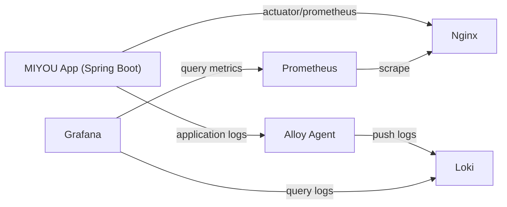
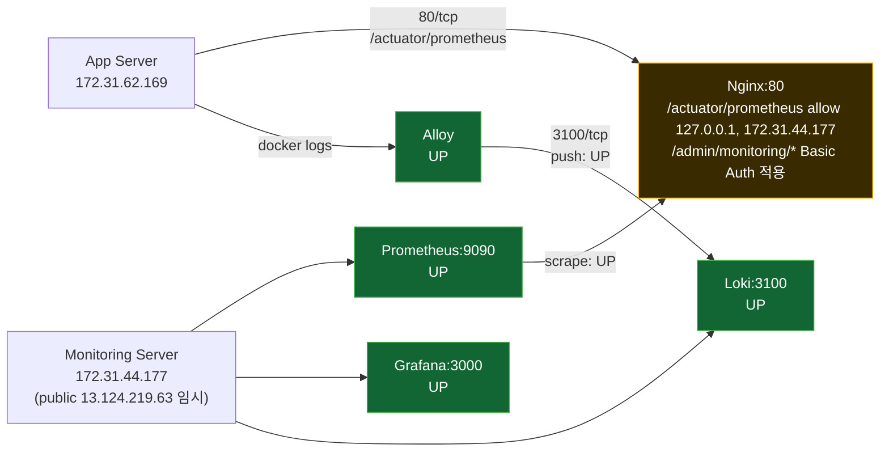

# 모니터링 서버 아키텍처 설계서

## 1. 목적
- 운영 환경에서 애플리케이션 상태를 안정적으로 관측하기 위한 **분리형 모니터링 서버**를 설계한다.
- 1차 목표는 Prometheus 기반 메트릭 수집 안정화이며, 이후 Grafana/Loki로 확장한다.

## 2. 설계 원칙
- 모니터링 서버는 애플리케이션 서버와 **물리/논리 분리**한다.
- 앱/DB 포트는 외부 미노출, 내부망(private) 통신 우선.
- 구성 요소는 단계적으로 추가한다. (Prometheus → Grafana → Loki/Alloy)
- 운영 자동화는 스크립트/Compose/CI-CD로 재현 가능해야 한다.

## 3. 단계별 구성

### Phase 1 (현재 진행)
- 모니터링 서버:
  - Prometheus
- 애플리케이션 서버:
  - Spring Actuator + Micrometer Prometheus endpoint(`/actuator/prometheus`)
  - Nginx에서 `/actuator/prometheus` 경로를 모니터링 서버 IP만 허용

### Phase 2
- 모니터링 서버:
  - Grafana 추가
  - Prometheus datasource provisioning
  - 기본 운영 대시보드(서비스 상태/지연/에러율) 구성

### Phase 3 (선택)
- 모니터링 서버:
  - Loki 추가(로그 저장)
- 애플리케이션 서버:
  - Alloy 배치(또는 Promtail)로 로그 수집/전송

## 4. 컴포넌트 배치

### 애플리케이션 서버(웹 서버)
- Nginx: 80 외부 노출
- App: 8081 내부 노출
- Mongo/Redis/Qdrant: 내부 네트워크 전용

### 모니터링 서버
- Prometheus: 9090
- (추가 예정) Grafana: 3000
- (선택) Loki: 3100

## 5. 네트워크/보안 정책
- 앱 서버 SG:
  - `80` 공개(서비스 트래픽)
  - `/actuator/prometheus`는 Nginx allowlist로 `172.31.44.177`만 허용
- 모니터링 서버 SG:
  - 초기 구축 시 public IP 임시 허용 가능
  - 안정화 후 public IP 제거, private 접근만 허용
- 운영 목표:
  - Prometheus/Grafana UI는 외부 직접 공개하지 않고 VPN/SSM 터널 기반 접근

## 6. 타겟 식별 전략
- 단기: private IP 기반 scrape target (`<APP_PRIVATE_IP>:80`)
- 중기 권장:
  - Route53 Private DNS 또는 EC2 service discovery로 동적 타겟 관리
  - 보안그룹 참조 방식으로 IP 의존성 축소

## 7. 저장소/리소스 기준
- 모니터링 서버 최소 사양: `t3.small`, EBS `20GB+`
- 이유:
  - Prometheus TSDB/WAL 누적
  - Docker 이미지/로그/운영 여유 공간 필요

## 8. 운영 체크리스트
- Prometheus target 상태(`UP`) 확인
- `/actuator/prometheus` 외부 차단(allowlist 외 403) 확인
- 보존 기간/디스크 사용량 모니터링
- 재배포 시 설정 드리프트 없는지 확인

## 9. 현재 결정 사항
- 모니터링 서버 private IP: `172.31.44.177`
- 모니터링 서버 public IP: `13.124.219.63` (임시, 이후 제거)
- 우선순위: Prometheus 먼저 구축, Grafana는 후속 단계로 추가

## 10. 컴포넌트 역할 정리
- **Prometheus**: 애플리케이션 메트릭을 주기적으로 scrape하여 시계열 DB(TSDB)에 저장하고 PromQL로 조회한다.
- **Grafana**: Prometheus/Loki를 데이터소스로 사용해 대시보드 시각화, 탐색, 알림을 제공한다.
- **Loki**: 애플리케이션/인프라 로그를 중앙 저장하고 라벨 기반으로 검색한다.
- **Alloy**: 수집 에이전트로서 로그/메트릭/트레이스 데이터를 수집하여 Loki/OTLP 등으로 전달한다.

## 11. 관계도 (Mermaid)

## 12. 현재 구현 상태 (2026-02-15 업데이트)
- 모니터링 서버(`172.31.44.177`)에 `Prometheus`, `Grafana`, `Loki` 컨테이너 기동 완료
- 애플리케이션 서버(`172.31.62.169`)에 `Alloy` 컨테이너 기동 완료
- Prometheus -> App scrape 상태: `UP`
- Alloy -> Loki 전송 상태: `정상(로그 유입 확인)`
- 외부 직접 접근:
  - `13.124.219.63:3000`, `:9090`, `:3100` 는 현재 동작하나, 운영 안정화 후 SG 제한/비공개 전환 예정
- 앱 서버 Nginx 경유 접근:
  - `http://52.78.129.179/admin/monitoring/grafana/`
  - `http://52.78.129.179/admin/monitoring/prometheus/`
  - `http://52.78.129.179/admin/monitoring/loki/ready`
  - 위 경로는 Basic Auth로 보호

### 12.0 실시간 상태 다이어그램 (UP/DOWN, 포트, 접근제어)

### 12.1 남은 작업
- 모니터링 서버 public 노출 포트(`3000/9090/3100`) 최소화 또는 비공개 전환
- Grafana/Prometheus/Loki 접근 정책을 SG + Nginx 기준으로 최종 고정
- Basic Auth 계정/비밀번호를 SSM 파라미터 기반으로 관리(코드/문서 하드코딩 금지)
- 운영 대시보드/알림 룰 고도화

## 13. 작업 이력 요약 (2026-02-15)

### 13.1 네트워크/접근 장애
- 증상:
  - 외부에서 모니터링 서버 포트 접근 타임아웃
  - Alloy -> Loki `context deadline exceeded`
- 원인:
  - SG/NACL 경로 미반영 또는 잘못된 SG에 규칙 추가
- 조치:
  - SG 규칙 재적용 후 외부 헬스체크 및 내부 private 경로 확인
- 결과:
  - `3000/9090/3100` 외부 응답 확인
  - Alloy 로그 전송 정상화, Loki 라벨/스트림 유입 확인

### 13.2 Grafana 서브패스 404(Whitelabel) 장애
- 증상:
  - `/admin/monitoring/grafana/` 접근 시 Grafana 대신 앱의 Whitelabel 404 출력
- 원인:
  - Grafana 서브패스 미설정 + 프록시 경로 헤더 충돌
- 조치:
  - Grafana `GF_SERVER_ROOT_URL=/admin/monitoring/grafana/`
  - Grafana `GF_SERVER_SERVE_FROM_SUB_PATH=true`
  - Nginx 프록시 경로 정리 및 불필요 header 제거
- 결과:
  - `/admin/monitoring/grafana/login` 정상 응답(200)

### 13.3 인증 혼선(반복 로그인 팝업)
- 증상:
  - Basic Auth 입력 후 반복 인증창 표시
- 원인:
  - 사용자명 오타(`myyou` vs `miyou`)
  - `.htpasswd` 파일 권한 과도 제한(컨테이너 내부 읽기 실패)
- 조치:
  - 계정명 `miyou`로 통일
  - `.htpasswd` 권한 조정
  - 배포 스크립트에서 `.env.deploy` 기반 `.htpasswd` 자동생성 추가
- 결과:
  - 무인증 `401`, 인증 시 `200` 확인

### 13.4 자격증명 운영 정책
- Grafana admin 비밀번호는 서버에서 재설정 가능(grafana-cli)
- Nginx Basic Auth 값은 Git 커밋 금지
- `.env.deploy` / SSM 파라미터를 통해 주입하고, 배포 시 해시 파일(`.htpasswd`) 생성
