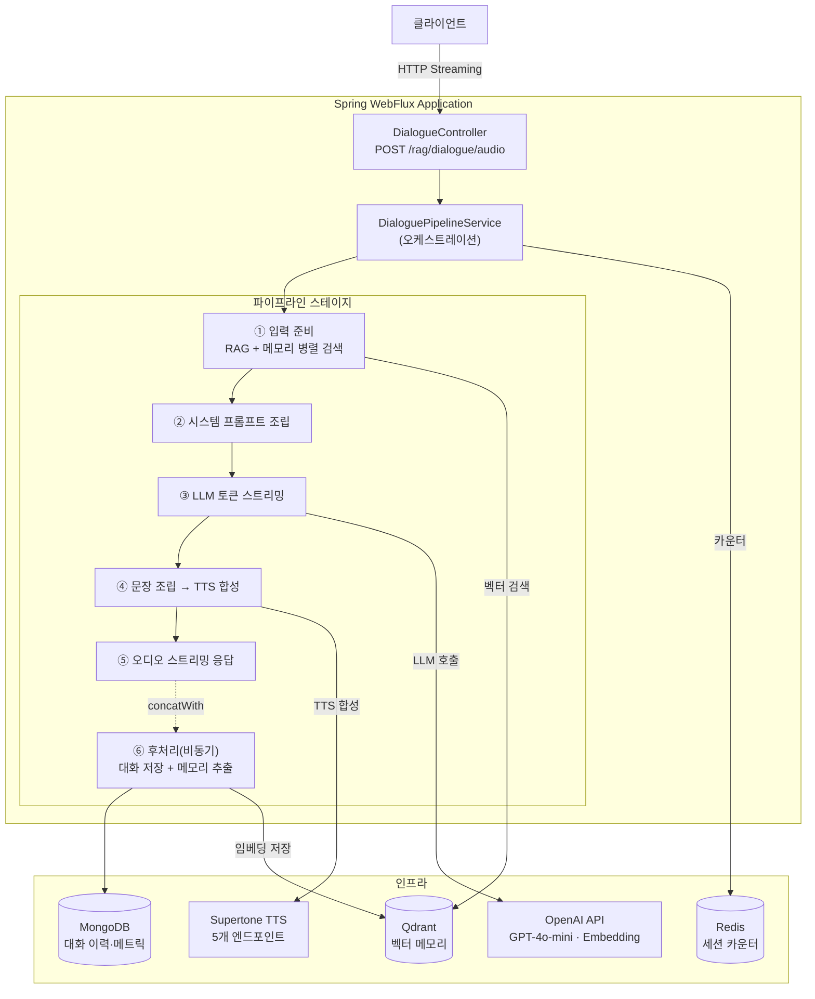
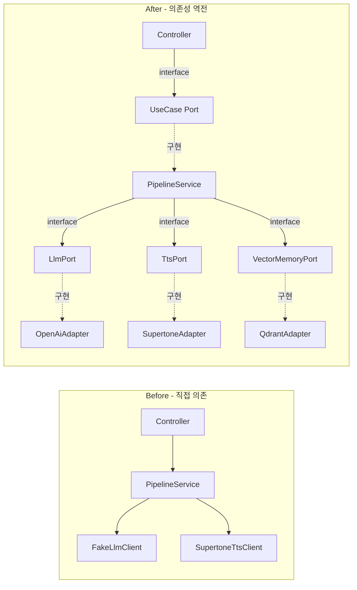
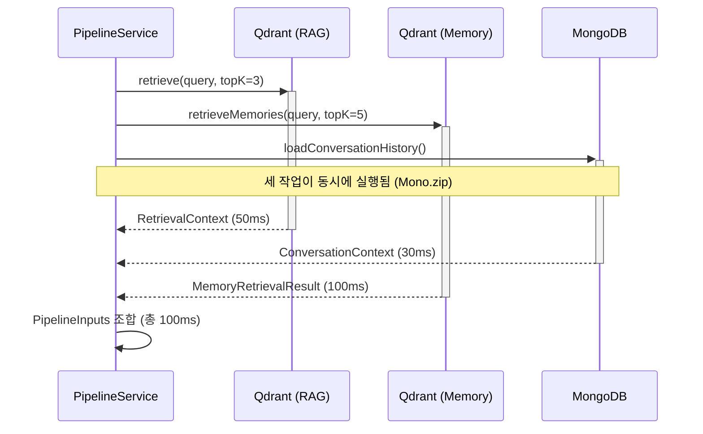
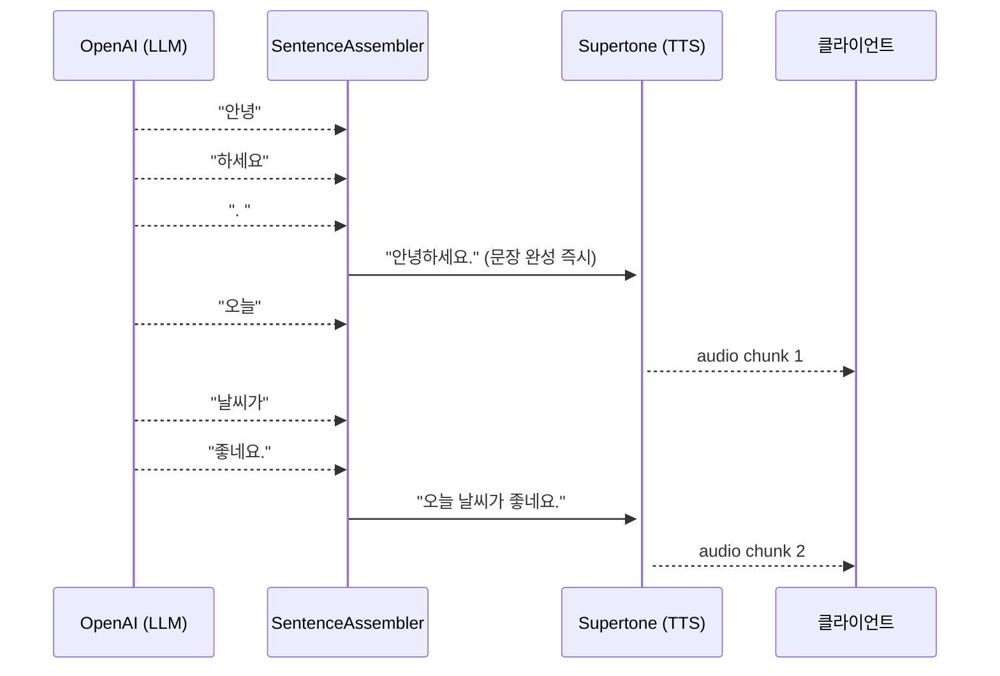

# 아키텍처 설계

## 전체 시스템 구성



---

## 헥사고날 아키텍처 (Ports & Adapters)

### Before → After 리팩토링

기존 구조는 단일 `voice/` 패키지에 모든 로직이 혼재하여 LLM 프로바이더 교체 시 서비스 코드 수정이 불가피했습니다.



### 계층 구조

```
domain/
 ├── port/
 │   ├── LlmPort               ← LLM 추상화
 │   ├── TtsPort               ← TTS 추상화
 │   ├── VectorMemoryPort      ← 벡터 DB 추상화
 │   ├── RetrievalPort         ← RAG 검색 추상화
 │   └── ConversationRepository
 └── model/                    ← 불변 Value Object (Java Record)
     ├── dialogue/  ConversationTurn, PersonaId
     ├── memory/    Memory, ExtractedMemory
     └── voice/     Voice, VoiceSettings, AudioFormat

application/
 ├── dialogue/  DialoguePipelineService, DialogueController
 └── memory/    MemoryExtractionService, MemoryRetrievalService

infrastructure/
 ├── dialogue/adapter/  OpenAiLlmAdapter, SupertoneTtsAdapter
 ├── memory/adapter/    QdrantVectorAdapter, RedisCounterAdapter
 └── retrieval/adapter/ VectorMemoryRetrievalAdapter
```

**핵심 원칙**: 도메인 레이어는 `reactor-core`(`Mono`/`Flux`)만 허용, Spring 프레임워크 의존 없음.
LLM·TTS·VectorDB 교체 시 해당 Adapter 파일만 수정하면 됩니다.

---

## 반응형 파이프라인 상세

### 입력 준비 단계 — `Mono.zip` 병렬 실행



순차 실행(180ms) → 병렬 실행(100ms): **44% 단축**

### 문장 조립 → TTS 선기동



LLM 응답 완료를 기다리지 않고 문장 단위로 TTS를 선기동하여 체감 지연을 최소화합니다.

### 후처리 비동기 분리

```java
// 응답 스트림과 후처리를 concatWith로 연결
// 클라이언트는 오디오를 받은 뒤 후처리가 백그라운드에서 실행됨
audioStream.concatWith(
    postProcessingService.process(inputs, llmResponse)
        .then(Mono.empty())
)
```

---

## SOLID 원칙 적용

| 원칙 | 적용 내용 |
|------|----------|
| **SRP** | `PipelineService`(오케스트레이션) · `LlmAdapter`(LLM 통신) · `SentenceAssembler`(문장 조립) 분리 |
| **OCP** | `LlmPort` 인터페이스로 새 LLM 추가 시 기존 코드 수정 불필요 |
| **LSP** | 모든 `LlmPort` 구현체(OpenAI·Claude·Gemini stub)는 동일하게 교체 가능 |
| **ISP** | `LlmPort`, `TtsPort`, `VectorMemoryPort` 각각 단일 역할만 정의 |
| **DIP** | `PipelineService`는 구체 클래스가 아닌 Port 인터페이스에 의존 |

---

## 관련 문서

- [아키텍처 Before/After 상세 비교](../architecture/ARCHITECTURE_COMPARISON.md)
- [리팩토링 진행 현황](../refactoring/REFACTORING_STATUS.md)
- [RAG 파이프라인 초기 설계](../architecture/rag-voice-pipeline.md)
