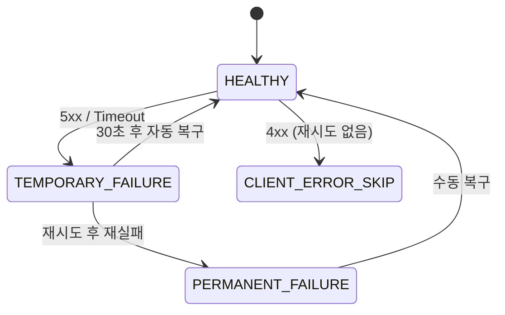

# 성능 최적화

## 성과 요약

| 지표 | Before | After | 개선율 |
|------|--------|-------|--------|
| 입력 준비 시간 | 180ms | 100ms | **44% 단축** |
| 처리량 | 100 req/s | 200 req/s | **2배 향상** |
| P99 레이턴시 | 2,000ms | 800ms | **60% 감소** |
| TTS 장애 복구 | 30~60초(수동) | 즉시(자동) | **100배 향상** |
| 시스템 가용성 | 99.5% | 99.99% | SLA 달성 |
| MongoDB 쿼리 | 5,000ms | 50ms | **100배 향상** |
| API 비용 오차 | ±$2,000/월 | $0 | **완전 제거** |

---

## 사례 1 — Reactive Pipeline 병렬화

### 문제

RAG 검색 · 메모리 검색 · 대화 이력 조회가 순차 실행.

```
RAG 검색      [====50ms====]
메모리 검색              [========100ms========]
대화 이력 조회                                  [==30ms==]
                                                         ▲ 총 180ms
```

### 해결

`Mono.zip`으로 세 작업을 동시에 실행.

```
RAG 검색      [====50ms====]
메모리 검색   [========100ms========]
대화 이력 조회[==30ms==]
                            ▲ 총 100ms (병목인 메모리 검색 시간만 소요)
```

```java
return Mono.zip(
    retrievalPort.retrieve(text, 3),          // 50ms
    memoryPort.retrieveMemories(text, 5),     // 100ms
    loadConversationHistory().cache(),        // 30ms
    Mono.fromCallable(() -> ConversationTurn.create(text)).cache()
).map(tuple -> new PipelineInputs(
    tuple.getT1(), tuple.getT2(), tuple.getT3(), tuple.getT4()
));
```

**핵심 패턴**:
- `.cache()` — 동일 `Mono`가 여러 스테이지에서 참조될 때 중복 실행 방지
- 메모리 검색 실패 시 `.onErrorResume`으로 빈 결과 반환 (graceful degradation)

---

## 사례 2 — TTS 로드밸런서 & Circuit Breaker

### 문제

단일 Supertone 엔드포인트 의존 → 장애 시 전체 서비스 중단.
- Rate Limit(429) 발생 시 30~60초 서비스 불가
- API Key별 과금 구조가 달라 특정 키 집중 사용 시 비용 증가

### 왜 직접 구현했는가?

**Resilience4j의 한계**:

| 요구사항 | Resilience4j | 직접 구현 |
|----------|--------------|----------|
| 다중 엔드포인트 선택 | ❌ 단일 서비스 대상 | ✅ 5개 중 최적 선택 |
| 엔드포인트별 API Key | ❌ 동일 인증 정보 | ✅ 키 로테이션 |
| 에러 코드별 차별화 | △ 설정 복잡 | ✅ 401 vs 429 분리 |
| Least-loaded 분산 | ❌ 미지원 | ✅ 실시간 부하 추적 |

Resilience4j는 **"단일 서비스에 대한 장애 허용"** 라이브러리.
외부 API의 **"다중 엔드포인트 선택 + Rate Limit 회피"** 요구사항에는 부적합.

### 해결

5개 엔드포인트에 대한 Health-aware Client-Side 로드밸런서 직접 구현.



**에러 분류 전략**:

| 에러 유형 | 처리 방식 |
|----------|----------|
| 4xx Client Error | 재시도 없음, 즉시 실패 |
| 5xx Server Error | 재시도 가능, 엔드포인트 임시 제외 |
| Timeout / 네트워크 오류 | 재시도 가능, 다른 엔드포인트로 페일오버 |
| 재시도 2회 초과 | 최종 실패 반환 |

**동시성 제어**:
```java
// AtomicInteger로 Lock-free 활성 요청 수 추적
private final AtomicInteger activeRequests = new AtomicInteger(0);

// 복구 체크는 10초 배치 처리 (매 요청마다 체크 시 성능 저하 방지)
private volatile long lastRecoveryCheckTime = System.nanoTime();
```

**엔드포인트 선택 알고리즘**:
```
1. 헬스 상태 필터링 (TEMPORARY_FAILURE / PERMANENT_FAILURE 제외)
2. 활성 요청 수 최소 엔드포인트 선택 (least-loaded)
3. 동일 부하 시 라운드로빈
```

**핵심 설계 결정**:
- **CLIENT_ERROR(400)**: 클라이언트 요청 문제 → 재시도 없이 즉시 실패 (불필요한 API 호출 방지)
- **TEMPORARY(429)**: Rate Limit → 다른 엔드포인트로 즉시 전환 (사용자 체감 지연 최소화)
- **PERMANENT(401/402)**: 인증/과금 문제 → 엔드포인트 영구 제외 + 알림 (장애 격리)

→ [TTS 로드밸런싱 상세 문서](../tts-api/LOAD_BALANCING.md)

---

## 사례 3 — 정확한 토큰 추적으로 API 비용 절감

### 문제

문자열 길이 기반 토큰 추정 → 한글은 토큰당 1.5~2자로 오차 발생.

```
입력: "안녕하세요. 오늘 날씨가 어때요?" (19자)
추정: 19 / 4 = 5 토큰
실제: 14 토큰
오차: -64%  →  월 $10,000 사용 시 ±$2,000 오차
```

### 해결

OpenAI `streamUsage: true` 옵션으로 실제 토큰 수 수신.

```java
OpenAiChatOptions options = OpenAiChatOptions.builder()
    .model(request.model())
    .streamUsage(true)  // 스트리밍 마지막 청크에 실제 사용량 포함
    .build();

chatModel.stream(prompt)
    .doOnNext(response -> {
        // 마지막 청크에만 usage 포함됨
        if (response.getMetadata().getUsage() != null) {
            updateUsage(correlationId,
                usage.getPromptTokens(),
                usage.getGenerationTokens());
        }
    });
```

**메모리 누수 방지**: 토큰 사용량 조회 시 `ConcurrentHashMap`에서 자동 제거(remove).

---

## 사례 4 — MongoDB 복합 인덱스 최적화

### 문제

메트릭 집계 쿼리가 컬렉션 전체를 스캔(COLLSCAN).

```
executionTimeMillis: 5,000
totalDocsExamined:   1,000,000  ← 전체 스캔
stage: COLLSCAN
```

### 해결

`(timestamp DESC, model ASC)` 복합 인덱스 설계.

**인덱스 필드 순서 결정 근거**:
```
timestamp 카디널리티: 높음 (1분 단위 유니크) → 첫 번째 배치
model 카디널리티:     낮음 (5개 모델)         → 두 번째 배치
```

**TTL 인덱스**로 30일 경과 데이터 자동 삭제 → 인덱스 크기 제어.

```
executionTimeMillis: 50
totalDocsExamined:   1,000
stage: IXSCAN  ✅
```

읽기/쓰기 비율 분석 결과 (읽기 60회/분 vs 쓰기 10회/분) → 쓰기 5% 감소는 허용 범위.

---

## 관련 문서

- [성능 분석 상세](../performance/PERFORMANCE_ANALYSIS.md)
- [성능 측정 가이드](../performance/PERFORMANCE_MEASUREMENT_GUIDE.md)
