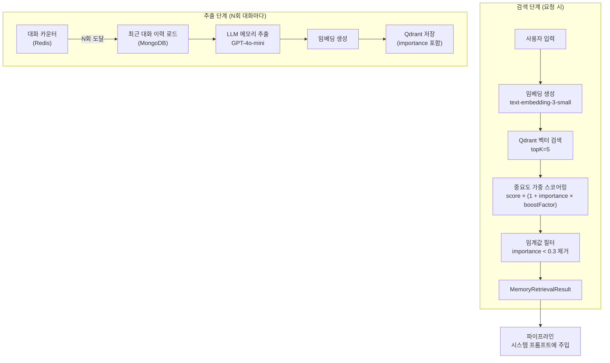
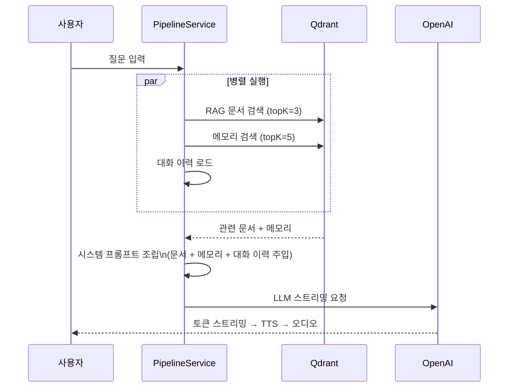
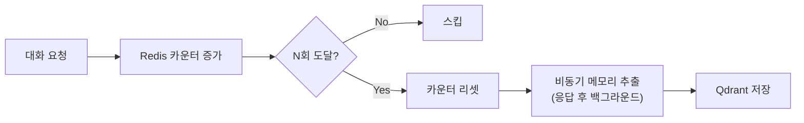

# 메모리 관리 & RAG 시스템

## 전체 흐름



---

## 메모리 데이터 모델

```
Memory
 ├── id          UUID
 ├── userId      UserId
 ├── personaId   PersonaId        ← 사용자별 메모리 격리
 ├── content     String           ← 추출된 핵심 정보
 ├── importance  float (0.0~1.0)  ← LLM이 판단한 중요도
 ├── embedding   float[1536]      ← 벡터 표현
 └── createdAt   Instant
```

`PersonaId` Value Object로 동일 사용자가 여러 페르소나(캐릭터)를 가질 때 메모리를 독립적으로 관리합니다.

---

## 벡터 검색 스코어링

단순 코사인 유사도 검색 대신 **중요도 가중치**를 반영한 복합 스코어링:

```
finalScore = cosineSimilarity × (1 + importance × boostFactor)
```

- 유사도가 같아도 중요도가 높은 메모리가 우선 반환됩니다.
- `importance < 0.3` 메모리는 결과에서 필터링하여 노이즈를 제거합니다.

---

## RAG 파이프라인



---

## 메모리 추출 트리거



메모리 추출은 응답 스트리밍 완료 후 백그라운드에서 실행되어 사용자 응답 지연에 영향을 주지 않습니다.

---

## 관련 문서

- [아키텍처 개요](./01-architecture.md)
- [RAG 파이프라인 초기 설계](../architecture/rag-voice-pipeline.md)
