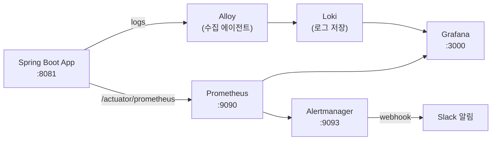
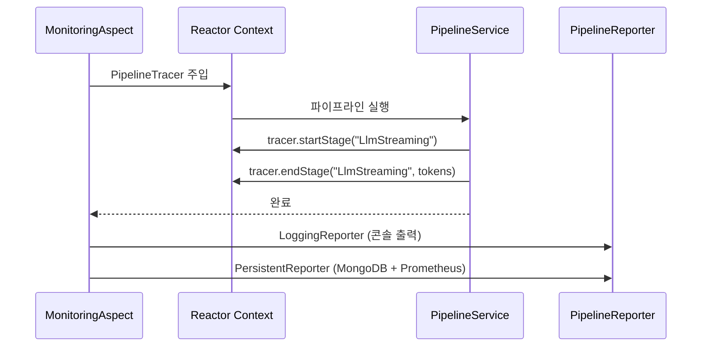

# 모니터링 & 관찰 가능성

## 모니터링 스택



---

## AOP 기반 파이프라인 계측

코드 수정 없이 `@MonitoredPipeline` 어노테이션만으로 파이프라인 전체를 자동 계측합니다.



### 수집 메트릭

| 메트릭 | 설명 |
|--------|------|
| `pipeline.stage.duration` | 스테이지별 처리 시간 |
| `pipeline.stage.gap` | 연속 스테이지 간 지연 |
| `pipeline.llm.tokens` | 입력/출력 토큰 수 |
| `pipeline.tts.endpoint` | TTS 엔드포인트별 성공/실패율 |
| `pipeline.memory.retrieved` | 메모리 검색 결과 수·스코어 |
| `pipeline.error.rate` | 스테이지별 오류율 |

---

## 파이프라인 타임라인 시각화 (Grafana)

```
시간 →
[Input     |████░░░░░░░░░░░░░░░░░░░░░░░░░░░] 100ms
[Prompt    |░░░░███░░░░░░░░░░░░░░░░░░░░░░░░]  15ms
[LLM       |░░░░░░░████████████████░░░░░░░░] 800ms
[TTS       |░░░░░░░░░░░░████████████████░░░] 600ms
[PostProc  |░░░░░░░░░░░░░░░░░░░░░░░░░░░████]  백그라운드
```

---

## 비용 추적


---

## 인프라 기동

```bash
# 모니터링 스택 전체 기동
docker-compose -f docker-compose.monitoring.yml up -d

# 접속
# Grafana    http://localhost:3000
# Prometheus http://localhost:9090
# Alertmanager http://localhost:9093
```

---

## 관련 문서

- [모니터링 통합 가이드](../monitoring/MONITORING_INTEGRATION.md)
- [Grafana 구현 계획](../monitoring/GRAFANA_IMPLEMENTATION_PLAN.md)
- [성능 측정 가이드](../performance/PERFORMANCE_MEASUREMENT_GUIDE.md)
