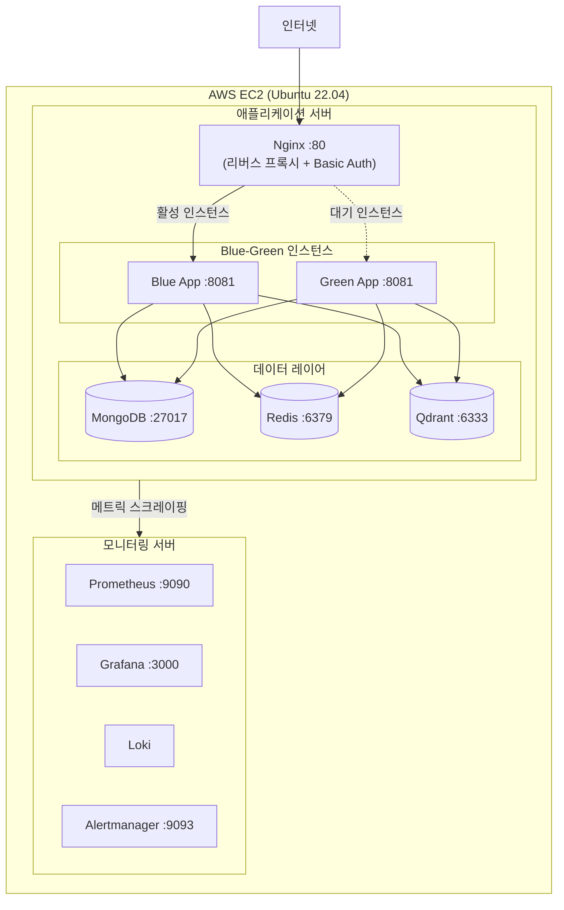
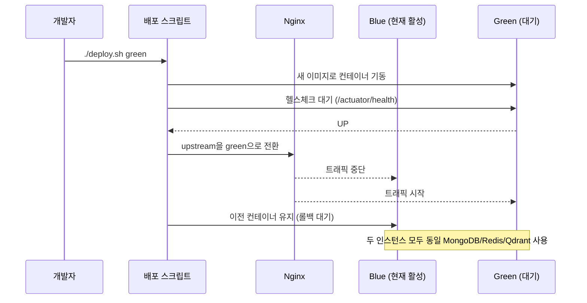
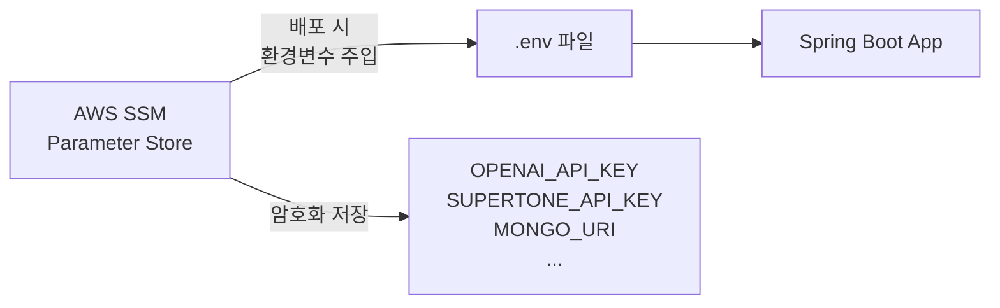

# 배포 & 인프라

## 전체 인프라 구성



---

## Blue-Green 무중단 배포



**stale 마커 자동 보정**: 배포 실패 시 active 마커가 잘못된 인스턴스를 가리키는 문제를 자동 감지·보정합니다.

---

## 시크릿 관리 (AWS SSM Parameter Store)



API 키 등 시크릿은 코드·파일에 포함되지 않으며, 배포 시점에 SSM에서 주입됩니다.

---

## Docker 이미지 빌드 (멀티 스테이지)

```dockerfile
# 1단계: 빌드 (의존성 캐시 최적화)
FROM gradle:8-jdk21 AS builder
COPY build.gradle settings.gradle ./
RUN gradle dependencies --no-daemon   # 의존성 레이어 캐시
COPY src ./src
RUN gradle bootJar --no-daemon

# 2단계: 실행 (JRE만 포함, 이미지 경량화)
FROM eclipse-temurin:21-jre-jammy
COPY --from=builder /app/build/libs/app.jar /app/app.jar
EXPOSE 8081
ENTRYPOINT ["java", "-jar", "/app/app.jar"]
```

---

## 로컬 개발 환경

```bash
# 인프라만 기동 (MongoDB, Redis, Qdrant)
docker-compose up -d

# 앱 실행
./gradlew :webflux-dialogue:bootRun

# 전체 스택 (앱 포함)
docker-compose -f docker-compose.app.yml up -d

# 모니터링 스택
docker-compose -f docker-compose.monitoring.yml up -d
```

| 서비스 | 로컬 포트 |
|--------|----------|
| 애플리케이션 | 8081 |
| MongoDB | 27018 |
| Redis | 16379 |
| Qdrant | 6333 |
| Grafana | 3000 |
| Prometheus | 9090 |

---

## 관련 문서

- [AWS 배포 가이드](../deployment/AWS_DEPLOYMENT_GUIDE.md)
- [CI/CD 옵션](../deployment/CI_CD_OPTIONS.md)
- [Nginx 배포 스펙](../spec/tech/nginx-cicd-deploy/README.md)
