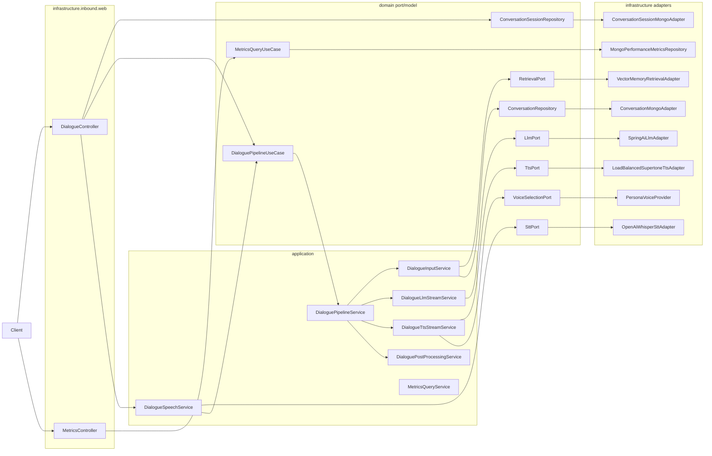
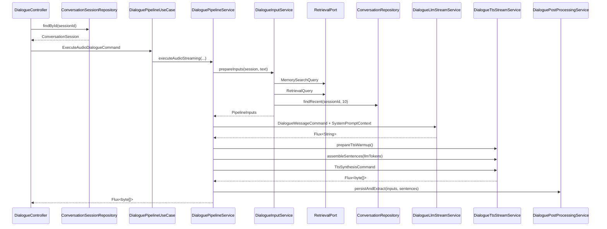

# MIYOU 헥사고날 아키텍처 리팩토링 현황

## 1) Background and objective
- 대상 모듈: `webflux-dialogue`
- 목적: 포트/어댑터 경계를 실제 코드와 테스트에서 강제하는 구조로 정리하고, 이후 DTO/Command/Query 정리까지 이어갈 수 있는 기준선을 만든다.
- 현재 판단:
  - 핵심 경계 복원은 완료됐다.
  - 2차 과제의 첫 단계로 주요 공개 시그니처는 Command/Query/Context 객체 기반으로 전환됐다.
  - 다만 STT 입력 경계와 패키지 명명 통일은 아직 남아 있다.

### 1.1 Current verdict
| 항목 | 상태 | 판단 |
| --- | --- | --- |
| `domain -> infrastructure` 차단 | 완료 | `HexagonalArchitectureTest`로 강제 중 |
| `application -> infrastructure` 차단 | 완료 | 정책/포트 경계로 정리됨 |
| Controller / Mongo document 위치 정리 | 완료 | `infrastructure.inbound.web`, `infrastructure..document`로 이동 완료 |
| 모니터링 계약 분리 | 완료 | `PipelineSummary`, `StageSnapshot`, `PipelineMetricsReporter`가 상위 계약으로 유지 |
| Command/Query/DTO 전환 | 부분 완료 | 주요 공개 시그니처는 전환됐고 STT/일부 후처리 입력만 남음 |
| outbound 패키지 명명 통일 | 미완료 | 실제 구현은 인프라에 있으나 `infrastructure.outbound.*`로 완전 통일되진 않음 |

### 1.2 Validation snapshot
| 검증 항목 | 결과 | 근거 |
| --- | --- | --- |
| 아키텍처 가드 | 통과 | `./gradlew :webflux-dialogue:test --tests "*HexagonalArchitectureTest"` |
| 모듈 전체 테스트 | 통과 | `./gradlew :webflux-dialogue:test` |
| 모니터링 key codec 보정 | 통과 | `MongoPerformanceMetricsRepositoryTest` round-trip 검증 추가 |
| 프롬프트 정책 null 방어 | 통과 | `SystemPromptServiceTest` null 정책 케이스 추가 |
| STT 정책/스냅샷 불변 조건 | 통과 | `SttPolicyTest`, `StageSnapshotTest` 추가 |
| DTO/Query 전환 회귀 | 통과 | pipeline/controller/retrieval/vector adapter 관련 테스트 통과 |

### 1.3 Current conclusion
- 현재 리팩토링은 "헥사고날 경계 복원" 기준으로는 완료 단계다.
- 현재 리팩토링은 "패키지 네이밍/DTO 전환까지 포함한 최종 정리" 기준으로는 아직 완료가 아니다.
- 따라서 이후 문서와 PR 설명은 "1차 구조 복원 완료, 2차 정리 과제 남음"으로 표현하는 것이 가장 정확하다.

## 2) Module structure (packages, responsibilities)

### 2.1 Current package map
| 영역 | 현재 패키지 | 책임 |
| --- | --- | --- |
| Domain | `domain.*.model`, `domain.*.service`, `domain.*.port` | 순수 모델, 도메인 서비스, 포트 계약 |
| Application dialogue | `application.dialogue.pipeline`, `application.dialogue.pipeline.stage`, `application.dialogue.service`, `application.dialogue.policy` | 대화 파이프라인 조합, STT 연계, 정책 적용 |
| Application memory | `application.memory.service`, `application.memory.policy` | 메모리 조회/추출 유스케이스 |
| Application monitoring | `application.monitoring.service`, `application.monitoring.context`, `application.monitoring.port`, `application.monitoring.aop` | 파이프라인 추적, 메트릭 조회 조합 |
| Infrastructure inbound | `infrastructure.inbound.web.dialogue`, `infrastructure.inbound.web.monitoring` | REST controller, HTTP DTO, API 문서 |
| Infrastructure dialogue | `infrastructure.dialogue.adapter.*`, `infrastructure.dialogue.config.*`, `infrastructure.dialogue.repository.*` | LLM/STT/TTS/Mongo 구현체와 Spring 조립 |
| Infrastructure memory/retrieval | `infrastructure.memory.*`, `infrastructure.retrieval.adapter.*` | 임베딩, Redis, Vector DB, retrieval 구현체 |
| Infrastructure monitoring | `infrastructure.monitoring.*`, `infrastructure.outbound.monitoring.*` | Mongo 문서/저장소, Micrometer, reporter 구현체 |
| Infrastructure common | `infrastructure.common.*` | 공통 설정, 상수, 템플릿 로더 어댑터 |

### 2.2 Current dependency model

### 2.3 Implemented state
- `domain` 패키지에는 Spring/Mongo/Micrometer 의존이 남아 있지 않다.
- `application` 서비스는 `RagDialogueProperties` 같은 인프라 설정 타입을 직접 보지 않는다.
- `RestController`와 Mongo `@Document`는 인프라 계층에만 존재한다.
- 모니터링 스냅샷과 reporter 계약은 `domain.monitoring` 중심으로 유지된다.
- `application.dialogue.controller`, `application.dialogue.dto`, `application.monitoring.controller`에는 현재 소스 파일이 없다. 남은 것은 빈 디렉터리 수준이다.

### 2.4 Remaining structural debt
| 항목 | 현재 위치 | 남은 문제 |
| --- | --- | --- |
| 남은 공개 시그니처 다중 인자 | `DialogueSpeechService`, 일부 후처리 경로 | STT 입력과 후처리 명령이 아직 Spring/FilePart 또는 값 조합 기반 |
| outbound 패키지 통일 | `infrastructure.dialogue.adapter.*`, `infrastructure.memory.adapter.*`, `infrastructure.retrieval.adapter.*` | 구조상 어댑터지만 `infrastructure.outbound.*` 네이밍으로 통일되지 않음 |
| 레거시 빈 디렉터리 정리 | `application.dialogue.controller`, `application.dialogue.dto`, `application.monitoring.controller` | 기능에는 영향 없지만 문서와 트리 가독성을 떨어뜨림 |

## 3) Runtime flow

### 3.1 Current runtime
1. `DialogueController`가 세션을 조회한 뒤 `ExecuteAudioDialogueCommand` 또는 `ExecuteTextDialogueCommand`를 만들어 `DialoguePipelineUseCase`로 전달한다.
2. `DialogueSpeechService`는 음성 파일을 검증하고 `SttPort`로 전사한 뒤 필요하면 `ExecuteTextDialogueCommand`를 만들어 다시 유스케이스로 연결한다.
3. `DialoguePipelineService`는 command에서 세션/텍스트를 꺼내 `DialogueInputService`로 넘기고, 이 서비스는 `RetrievalQuery`, `MemorySearchQuery`로 retrieval, memory, conversation history를 묶어 `PipelineInputs`를 만든다.
4. `DialogueLlmStreamService`는 `DialogueMessageCommand`와 `SystemPromptContext`를 조합해 메시지 목록을 만들고 `LlmPort`를 호출한다.
5. `DialogueTtsStreamService`는 `TtsSynthesisCommand`를 받아 문장 조립과 TTS warm-up, 음성 합성을 담당한다.
6. `DialoguePostProcessingService`는 대화 저장, 메모리 추출, 메트릭 후처리를 비동기로 연결한다.

### 3.2 Audio pipeline sequence

### 3.3 STT/text bridge flow
- `POST /rag/dialogue/stt`는 `DialogueSpeechService.transcribe(...)`만 호출한다.
- `POST /rag/dialogue/stt/text`는 전사 결과를 다시 `ExecuteTextDialogueCommand`로 감싸 유스케이스로 전달한다.
- 현재 STT 경로는 유스케이스 진입은 DTO화됐지만, `DialogueSpeechService.transcribe(FilePart, String)` 자체는 아직 Spring `FilePart`를 직접 받는다.

### 3.4 DTO and signature debt
| 현재 시그니처 | 현재 상태 | 다음 후보 |
| --- | --- | --- |
| `DialoguePipelineUseCase.executeAudioStreaming(ExecuteAudioDialogueCommand)` | 전환 완료 | 유스케이스 진입 command 도입 |
| `DialoguePipelineUseCase.executeTextOnly(ExecuteTextDialogueCommand)` | 전환 완료 | 동일 |
| `RetrievalPort.retrieve(RetrievalQuery)` | 전환 완료 | retrieval 질의 객체 도입 |
| `RetrievalPort.retrieveMemories(MemorySearchQuery)` | 전환 완료 | 메모리 검색 질의 객체 도입 |
| `VectorMemoryPort.search(VectorMemorySearchQuery)` | 전환 완료 | 벡터 검색 질의 객체 도입 |
| `VectorMemoryPort.updateImportance(MemoryImportanceUpdateCommand)` | 전환 완료 | 상태 변경 명령 객체 도입 |
| `SystemPromptService.buildSystemPrompt(SystemPromptContext)` | 전환 완료 | 프롬프트 컨텍스트 객체 도입 |
| `DialogueMessageService.buildMessages(DialogueMessageCommand)` | 전환 완료 | 메시지 조립 입력 객체 도입 |
| `DialogueTtsStreamService.buildAudioStream(TtsSynthesisCommand)` | 전환 완료 | TTS 합성 입력 객체 도입 |
| `DialogueSpeechService.transcribe(FilePart, String)` | 잔여 | Spring 타입을 직접 받는 경계가 남아 있음 |

`PipelineInputs`는 이미 도입되어 있어 입력 준비 단계의 1차 DTO 묶음 역할을 수행한다.

## 4) Configuration contract

### 4.1 Implemented configuration boundary
| 설정 지점 | 변환 결과 | 소비 위치 |
| --- | --- | --- |
| `DialoguePolicyConfiguration` | `DialogueExecutionPolicy`, `PromptTemplatePolicy`, `MemoryRetrievalPolicy`, `MemoryExtractionPolicy`, `SttPolicy` | `application.dialogue.*`, `application.memory.*` |
| `DialogueVoiceConfiguration`, `TtsConfiguration` | `VoiceSelectionPort`, `TtsPort` 구현체 조립 | `DialogueTtsStreamService` |
| `MemoryConfiguration` | embedding/vector/redis 관련 포트 구현체 조립 | memory/retrieval application 서비스 |
| `MonitoringConfiguration` | composite reporter, persistence reporter, logging reporter 조립 | monitoring application/service |
| `FileBasedPromptTemplateAdapter` | `TemplateLoaderPort` 구현 | `SystemPromptService` |

### 4.2 Contract changes already landed
- `application`은 `RagDialogueProperties`를 직접 주입받지 않는다.
- 템플릿 파일 로딩은 `TemplateLoaderPort`로 숨겨져 있다.
- 프롬프트 정책 문자열은 `PromptTemplatePolicy`에서 null을 정규화한다.
- STT 설정은 `SttPolicy`에서 양수 크기와 기본 언어를 검증한다.
- `StageSnapshot`은 생성 시 `attributes`를 불변 복사해 모니터링 스냅샷 오염을 막는다.
- 대화 파이프라인 진입과 retrieval/vector memory 포트는 명명된 command/query record를 사용한다.

### 4.3 Remaining contract gaps
| 항목 | 현재 상태 | 후속 방향 |
| --- | --- | --- |
| STT 입력 객체 | `DialogueSpeechService`가 `FilePart`, `language`를 직접 받음 | Spring 타입을 숨기는 전용 command/mapper 도입 검토 |
| 후처리 명령 객체 | `DialoguePostProcessingService`가 `PipelineInputs`, `Flux<String>`를 직접 조합 | `PersistConversationCommand`, `MemoryExtractionCommand` 후보 |
| 파라미터 규칙 자동화 | ArchUnit은 계층 경계만 강제 | 다중 인자 공개 메서드 경고 규칙 추가 검토 |

## 5) Extension/migration strategy

### 5.1 Recommended next order
1. 남은 STT/후처리 입력 DTO 전환
2. 어댑터 패키지 명명 통일
   - `infrastructure.dialogue.adapter.*`
   - `infrastructure.memory.adapter.*`
   - `infrastructure.retrieval.adapter.*`
   - 위 경로를 `infrastructure.outbound.*` 규칙으로 재배치
3. 빈 레거시 디렉터리 정리
4. 필요하면 ArchUnit 규칙에 parameter-object 가드 추가

### 5.2 Done vs next
| 구분 | 완료 정의 | 현재 상태 |
| --- | --- | --- |
| 1차 리팩토링 | 계층 경계 복원, 문서/정책/모니터링 계약 분리, 아키텍처 테스트 도입 | 완료 |
| 2차 리팩토링 | DTO/Command/Query 전환, 패키지 명명 통일, 빈 레거시 경로 정리 | 진행 전 또는 일부만 진행 |
| 멀티모듈 분리 | Gradle 모듈 분리 검토 | 아직 시작하지 않음 |

### 5.3 Documentation rule
- 앞으로 이 문서는 "미래 권장안"보다 "현재 구현 상태"를 우선 기록한다.
- 아직 구현되지 않은 항목은 `남은 과제`로 분리해 적는다.
- PR 본문과 문서의 완료 표현은 동일하게 유지한다.

## 6) Review checklist
- [x] `domain` 패키지가 Spring/Mongo/Micrometer 구현 의존을 갖지 않는다
- [x] `application` 패키지가 `infrastructure` 구현체를 직접 import 하지 않는다
- [x] `RestController`는 `infrastructure.inbound.web..`에만 존재한다
- [x] Mongo `@Document`는 `infrastructure..document`에만 존재한다
- [x] 정책 값 검증과 기본 정규화가 `PromptTemplatePolicy`, `SttPolicy`에 반영되어 있다
- [x] 모니터링 스냅샷이 외부 가변 맵에 오염되지 않도록 방어 복사된다
- [x] 문서에 적힌 핵심 경계 복원 상태가 현재 코드와 일치한다
- [x] `DialoguePipelineUseCase`, `RetrievalPort`, `VectorMemoryPort`가 DTO/Command/Query 기반으로 전환되었다
- [ ] 인프라 어댑터 패키지가 `infrastructure.outbound.*` 규칙으로 완전히 통일되었다
- [ ] ArchUnit이 parameter-object 전환 기준까지 자동 강제한다
