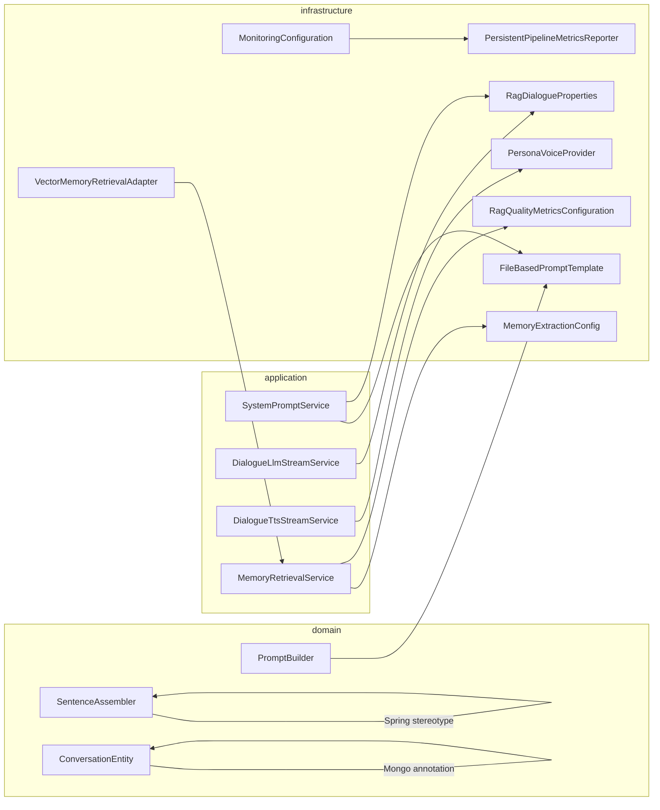
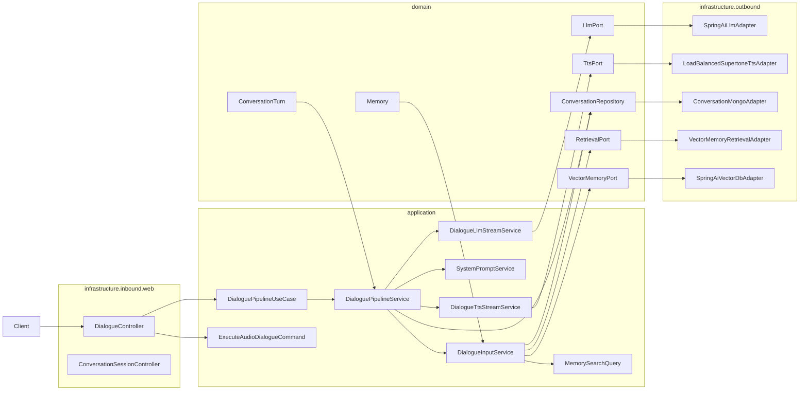
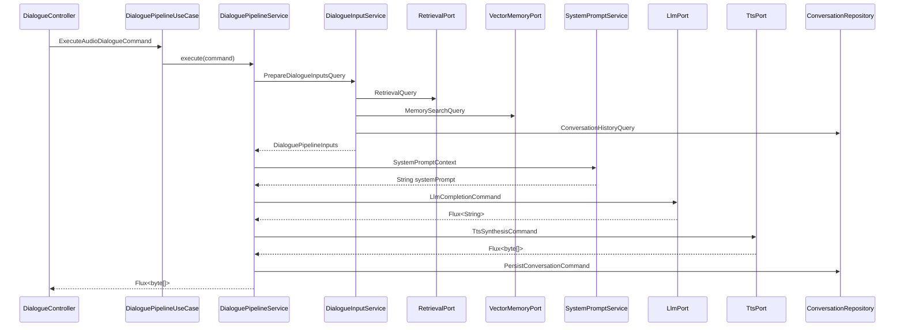

# MIYOU 헥사고날 아키텍처 리팩토링 권장 문서

## 1) Background and objective
- 목적: `webflux-dialogue` 모듈을 "포트/어댑터 용어를 사용하는 Spring 계층 구조"에서 "경계가 실제로 강제되는 헥사고날 아키텍처"로 재정렬한다.
- 범위:
  - `webflux-dialogue/src/main/java/com/study/webflux/rag/domain`
  - `webflux-dialogue/src/main/java/com/study/webflux/rag/application`
  - `webflux-dialogue/src/main/java/com/study/webflux/rag/infrastructure`
  - `webflux-dialogue/build.gradle`
- 배경:
  - 현재 구현은 포트 인터페이스와 어댑터 개념을 이미 도입했다.
  - 그러나 `domain -> infrastructure`, `application -> infrastructure`, `infrastructure -> application` 역참조가 동시에 존재한다.
  - 다중 파라미터 시그니처가 여러 계층에 산재해 있어, 정책 필드 추가 시 호출부가 넓게 깨질 가능성이 높다.
- 최종 목표:
  - `domain` 에서 Spring/Mongo/Web 관련 의존을 제거한다.
  - `application` 은 유스케이스와 오케스트레이션, DTO/Command/Query 조립에만 집중한다.
  - `infrastructure` 는 웹, Mongo, Redis, OpenAI, Qdrant, Micrometer, 템플릿 파일 로딩 같은 구현체로 한정한다.
  - 경계 너머로 전달되는 데이터는 순수 파라미터보다 의미가 드러나는 객체 DTO를 우선 사용한다.
  - 아키텍처 규칙을 ArchUnit 또는 동등한 테스트로 자동 강제한다.

### 1.1 Validation result snapshot
| 항목 | 결과 | 해석 |
| --- | --- | --- |
| `domain` 내 프레임워크 오염 파일 | 8개 | Spring/Mongo 어노테이션이 핵심 계층에 침투 |
| `application -> infrastructure` import 파일 | 7개 | 유스케이스 계층이 구현/설정에 직접 결합 |
| `infrastructure -> application` import 파일 | 4개 | 어댑터가 다시 상위 계층을 참조 |
| 아키텍처 강제 테스트 | 없음 | 위반이 빌드에서 차단되지 않음 |

### 1.2 Representative issue map
| 카테고리 | 현재 예시 | 문제 |
| --- | --- | --- |
| 도메인 프레임워크 오염 | `domain.dialogue.service.PromptBuilder`, `domain.dialogue.service.SentenceAssembler` | `@Component`, `@Service` 사용 |
| 도메인 persistence 오염 | `domain.dialogue.entity.ConversationEntity`, `domain.monitoring.entity.PerformanceMetricsEntity` | `@Document`, `@Indexed`, Mongo 스키마 위치 오류 |
| 애플리케이션의 구현체 직접 의존 | `application.dialogue.pipeline.stage.SystemPromptService` | `FileBasedPromptTemplate`, `RagDialogueProperties` 직접 주입 |
| 인프라의 상위 계층 역참조 | `infrastructure.retrieval.adapter.VectorMemoryRetrievalAdapter` | `MemoryRetrievalService` 에 직접 의존 |
| 파라미터 응집 부족 | `DialogueMessageService.buildMessages(...)`, `VectorMemoryPort.search(...)` | 인자 의미가 분산되고 확장 비용이 큼 |

현재 상태(Implemented):
- 구조 위반 지점이 코드 기준으로 식별되어 있다.
- 포트 기반 진입점 일부(`DialoguePipelineUseCase`, `LlmPort`, `TtsPort`, `ConversationRepository`)는 이미 존재한다.

미래 상태(TODO):
- 레이어 의존을 단방향으로 복원한다.
- DTO/Command/Query 객체를 도입해 시그니처를 재정렬한다.
- 문서 규칙을 테스트와 패키지 구조로 고정한다.

## 2) Module structure (packages, responsibilities)

### 2.1 Current-state dependency leakage


### 2.2 Recommended target package map
| 레이어 | 권장 패키지 | 책임 | 허용 의존 |
| --- | --- | --- | --- |
| Domain | `domain.*.model`, `domain.*.service`, `domain.*.port` | 순수 모델, 비즈니스 규칙, 포트 계약 | JDK, Reactor, 같은 `domain` |
| Application | `application.*.usecase`, `application.*.service`, `application.*.command`, `application.*.query`, `application.*.dto` | 유스케이스 조합, 트랜잭션 경계, DTO 조립, 정책 실행 | `domain`, 같은 `application` |
| Infrastructure inbound | `infrastructure.inbound.web.*` | Controller, Request/Response DTO, HTTP 매핑 | `application`, `domain` 값 객체 |
| Infrastructure outbound | `infrastructure.outbound.*` | Mongo/Redis/Qdrant/OpenAI/Supertone/Micrometer 구현체 | `domain` 포트, `application` 포트(필요 시) |
| Infrastructure config | `infrastructure.config.*` | Spring Bean 등록, `@ConfigurationProperties`, 구현체 조립 | 모든 인프라 구현체, 포트 계약 |

### 2.3 Recommended relocation map
| 현재 위치 | 권장 위치 | 이유 |
| --- | --- | --- |
| `domain.dialogue.entity.ConversationEntity` | `infrastructure.outbound.persistence.mongo.dialogue.ConversationDocument` | Mongo 스키마는 도메인이 아니라 저장 어댑터 책임 |
| `domain.dialogue.entity.ConversationSessionEntity` | `infrastructure.outbound.persistence.mongo.dialogue.ConversationSessionDocument` | 동일 |
| `domain.monitoring.entity.*` | `infrastructure.outbound.persistence.mongo.monitoring.*Document` | 모니터링 저장 모델은 persistence 세부 구현 |
| `application.dialogue.controller.*` | `infrastructure.inbound.web.dialogue.*` | Controller 는 inbound adapter |
| `application.dialogue.dto.*` | `infrastructure.inbound.web.dialogue.dto.*` | HTTP request/response DTO 는 transport contract |
| `application.monitoring.monitor.LoggingPipelineMetricsReporter` | `infrastructure.outbound.monitoring.logging.*` | 로그 출력도 adapter |
| `application.monitoring.monitor.PersistentPipelineMetricsReporter` | `infrastructure.outbound.monitoring.mongo.*` | 영속 저장 reporter 는 adapter |
| `domain.dialogue.service.PromptBuilder` | `application.dialogue.service.SystemPromptComposer` 또는 `domain` 순수 서비스 + 포트 사용 | 현재는 구현체 import 때문에 domain 부적합 |

### 2.4 Recommended target dependency model


### 2.5 DTO-first boundary rule
- 원칙: 계층 경계를 넘는 호출이 3개 이상의 값을 받거나, 옵션/정책/메타데이터 확장 가능성이 보이면 DTO를 우선한다.
- 목적:
  - 시그니처 추가 변경을 DTO 필드 확장으로 흡수
  - 인자 순서 오류 차단
  - 도메인 의도를 타입 이름에 반영
  - OCP 관점에서 정책 확장을 호출부 전면 수정 없이 처리
- 금지 방향:
  - `String`, `int`, `float`, `boolean` 조합을 의미 없이 길게 나열
  - 서로 관련된 값을 여러 메서드에서 반복 전달
  - 설정/메타데이터를 nullable parameter 로 계속 이어붙이기

### 2.6 DTO conversion candidates
| 현재 시그니처 | 권장 객체 | 비고 |
| --- | --- | --- |
| `DialoguePipelineUseCase.executeAudioStreaming(ConversationSession, String, AudioFormat)` | `ExecuteAudioDialogueCommand` | 확장 후보: `metadata`, `requestedVoice`, `transport` |
| `DialogueMessageService.buildMessages(PersonaId, RetrievalContext, MemoryRetrievalResult, ConversationContext, String)` | `DialogueMessageCommand` | 의미 응집이 분명한 대표 후보 |
| `SystemPromptService.buildSystemPrompt(PersonaId, RetrievalContext, MemoryRetrievalResult)` | `SystemPromptContext` | persona/context/memory bundle |
| `DialogueTtsStreamService.buildAudioStream(Flux<String>, Mono<Void>, AudioFormat, PersonaId)` | `TtsSynthesisCommand` | 보이스 선택 정책과 포맷 확장에 유리 |
| `RetrievalPort.retrieve(ConversationSessionId, String, int)` | `RetrievalQuery` | 향후 필터/시간 범위 추가 가능 |
| `RetrievalPort.retrieveMemories(ConversationSessionId, String, int)` | `MemorySearchQuery` | 동일 |
| `VectorMemoryPort.search(ConversationSessionId, List<Float>, List<MemoryType>, float, int)` | `VectorMemorySearchQuery` | 가장 우선순위가 높은 DTO 후보 |
| `VectorMemoryPort.updateImportance(String, float, Instant, int)` | `MemoryImportanceUpdateCommand` | 상태 변경 의도를 타입으로 표현 |

## 3) Runtime flow

### 3.1 Current runtime pain points
1. Controller 가 유스케이스 포트에 연결되는 지점은 괜찮다.
2. 입력 준비 단계에서 `RetrievalPort` 는 유지되지만, 내부 구현 일부가 다시 `application` 서비스에 역참조한다.
3. 시스템 프롬프트/LLM/TTS 단계는 정책과 템플릿, 보이스 선택을 위해 인프라 타입을 직접 주입받는다.
4. 후처리/모니터링 단계는 저장 어댑터와 메트릭 reporter 책임이 혼재되어 있다.
5. 결과적으로 런타임 흐름은 직선형이지만, 설계 경계는 톱니처럼 교차한다.

### 3.2 Recommended target runtime
1. `DialogueController` 가 HTTP request 를 `ExecuteAudioDialogueCommand` 로 변환한다.
2. `DialoguePipelineUseCase` 는 command 를 입력으로 받아 애플리케이션 유스케이스를 시작한다.
3. `DialogueInputService` 는 `RetrievalQuery`, `MemorySearchQuery`, `ConversationHistoryQuery` 를 생성한다.
4. `RetrievalPort`, `ConversationRepository`, `VectorMemoryPort` 는 query 객체만 받고 구현체는 인프라에서 처리한다.
5. `SystemPromptService` 는 `SystemPromptContext` 를 입력으로 받아 프롬프트를 조립한다.
6. `DialogueLlmStreamService` 는 `LlmCompletionCommand` 로 LLM 포트를 호출한다.
7. `DialogueTtsStreamService` 는 `TtsSynthesisCommand` 로 TTS 포트를 호출한다.
8. 후처리는 `PersistConversationCommand`, `MemoryExtractionCommand`, `PipelineMetricsCommand` 로 분리한다.

### 3.3 Target sequence


### 3.4 DTO example sketch
```java
public record ExecuteAudioDialogueCommand(
	String sessionId,
	String userText,
	AudioFormat audioFormat,
	String personaId,
	Map<String, Object> metadata
) {
}

public record DialogueMessageCommand(
	PersonaId personaId,
	RetrievalContext retrievalContext,
	MemoryRetrievalResult memoryResult,
	ConversationContext conversationContext,
	String currentQuery
) {
}

public record VectorMemorySearchQuery(
	ConversationSessionId sessionId,
	List<Float> queryEmbedding,
	List<MemoryType> types,
	float importanceThreshold,
	int topK
) {
}
```

### 3.5 DTO adoption guideline
- 단일 값 객체 하나만 전달하는 메서드는 굳이 DTO로 감싸지 않는다.
- 두세 개 이하라도 함께 움직이는 정책 집합이면 DTO를 만든다.
- `null` 로 옵션을 전달하는 메서드는 DTO 전환 우선순위를 높인다.
- 외부 입력(HTTP, 메시지, 스케줄러, 배치)은 항상 명명된 request/command 객체로 시작한다.
- 포트 인터페이스는 primitive 중심보다 의미 중심 타입을 우선한다.

## 4) Configuration contract

### 4.1 Current-state contract problem
| 현재 타입 | 현재 소비 위치 | 문제 |
| --- | --- | --- |
| `RagDialogueProperties` | `SystemPromptService`, `DialogueLlmStreamService`, `DialoguePostProcessingService`, `DialogueSpeechService` | 애플리케이션이 `@ConfigurationProperties` 구조를 직접 안다 |
| `FileBasedPromptTemplate` | `PromptBuilder`, `SystemPromptService` | 파일 로딩 구현이 상위 계층으로 누출 |
| `PersonaVoiceProvider` | `DialogueTtsStreamService` | 보이스 선택 정책이 인프라 구현체에 묶임 |
| `MemoryExtractionConfig` | `MemoryRetrievalService` | 애플리케이션이 인프라 설정 레코드를 직접 사용 |
| `RagQualityMetricsConfiguration`, `MemoryExtractionMetricsConfiguration` | `MemoryRetrievalService`, `MemoryExtractionService` | Micrometer 빈이 애플리케이션 서비스 시그니처에 노출 |

### 4.2 Target configuration rule
- `RagDialogueProperties` 는 `infrastructure.config.properties` 에만 남긴다.
- `@Configuration` 에서 `RagDialogueProperties` 를 읽고, 아래의 애플리케이션 친화적 DTO 또는 정책 객체로 변환해 주입한다.
  - `DialogueExecutionPolicy`
  - `PromptTemplatePolicy`
  - `MemoryRetrievalPolicy`
  - `MemoryExtractionPolicy`
  - `TtsSynthesisPolicy`
- 애플리케이션은 Spring `Environment`, `@ConfigurationProperties`, Micrometer `MeterRegistry` 를 직접 모르면 된다.
- 메트릭 기록은 `application.monitoring.port.PipelineMetricsPort` 같은 추상화 뒤로 숨긴다.

### 4.3 Recommended contract objects
| 분류 | 권장 타입 | 책임 |
| --- | --- | --- |
| 실행 정책 | `DialogueExecutionPolicy` | 기본 모델, 기본 포맷, timeout, threshold |
| 프롬프트 정책 | `PromptTemplatePolicy` | base/common/persona 템플릿 경로 |
| 메모리 조회 질의 | `MemorySearchQuery` | 세션, 질의, topK, 필터 |
| 메모리 추출 정책 | `MemoryExtractionPolicy` | threshold, extraction model, importance boost |
| TTS 합성 명령 | `TtsSynthesisCommand` | sentence stream source, voice, format, warmup |
| 메트릭 기록 명령 | `PipelineMetricRecord` | metric name, tags, numeric value, stage |

### 4.4 Recommended port split
| 현재 경계 | 권장 경계 |
| --- | --- |
| `FileBasedPromptTemplate` 직접 주입 | `PromptTemplateLoaderPort` 또는 `PromptTemplateRepositoryPort` |
| `PersonaVoiceProvider` 직접 주입 | `VoiceSelectionPort` |
| `RagQualityMetricsConfiguration` 직접 주입 | `RagQualityMetricsPort` |
| `MemoryExtractionMetricsConfiguration` 직접 주입 | `MemoryExtractionMetricsPort` |
| `PipelineMetricsReporter` + `DialoguePipelineTracker.PipelineSummary` 직접 공유 | `PipelineMetricsPort` + 독립 DTO `PipelineMetricsSnapshot` |

### 4.5 OCP-oriented DTO rule
- 필드 추가 가능성이 있는 정책은 primitive 인수 확장이 아니라 record 확장으로 처리한다.
- 신규 옵션이 생겨도 호출부를 전부 수정하지 않도록, 기본값/정책은 DTO 팩토리 또는 빌더에서 흡수한다.
- 외부 시스템별 차이는 DTO 자체가 아니라 adapter 내부 전략으로 분기한다.
- DTO는 mutable bean 보다 immutable record 를 우선한다.

## 5) Extension/migration strategy

### 5.1 Migration principles
- 1회 대수술보다 경계별 점진 이전을 선택한다.
- 단계별로 컴파일 안전성을 유지한다.
- DTO 도입은 "호출 시그니처 단순화"와 "경계 명시화" 두 목표를 동시에 만족해야 한다.
- 패키지 이동만 먼저 하고, 동작 변경은 뒤로 미룬다.

### 5.2 Phase plan
| Phase | 목표 | 주요 작업 | 완료 조건 | 상태 |
| --- | --- | --- | --- | --- |
| 0 | 가드레일 확보 | ArchUnit 또는 유사 테스트 추가 | `domain` 의 Spring import 가 빌드 실패로 차단 | TODO |
| 1 | domain 정화 | `@Document`/Mongo entity 를 infra 로 이동, mapper 분리 | `domain` 에 Spring Data annotation 없음 | TODO |
| 2 | DTO 도입 | 대표 시그니처를 Command/Query DTO 로 전환 | 3개 이상 인자 공개 메서드 제거 | TODO |
| 3 | application 경계 복원 | `RagDialogueProperties`, template loader, metrics config 직접 주입 제거 | `application -> infrastructure` import 0 | TODO |
| 4 | inbound/outbound adapter 정리 | controller, response DTO, reporter 구현체를 infra 로 이동 | 웹/로그/DB adapter 가 infra 에 모임 | TODO |
| 5 | monitoring 경계 재구성 | `PipelineSummary` 를 독립 DTO 로 분리, port 재정의 | infra 가 application concrete type 에 직접 의존하지 않음 | TODO |
| 6 | 모듈 분리 검토 | 필요 시 Gradle 멀티모듈(`domain-core`, `application-core`, `infrastructure-web`) 검토 | 패키지 규칙이 장기적으로 유지 가능 | TODO |

### 5.3 Highest-priority changes
1. `domain` 의 Mongo 문서 클래스 이동
2. `PromptBuilder` 와 `SystemPromptService` 의 템플릿 로딩 경계 재정의
3. `MemoryRetrievalService` 의 설정/메트릭 의존 제거
4. `VectorMemoryRetrievalAdapter -> MemoryRetrievalService` 역참조 제거
5. `PipelineMetricsReporter` 계약과 구현 위치 재정렬

### 5.4 File-by-file recommendation
| 파일 | 권장 조치 |
| --- | --- |
| `domain/dialogue/service/PromptBuilder.java` | domain 밖으로 이동하거나 순수 문자열 조립 서비스로 축소 |
| `domain/dialogue/service/SentenceAssembler.java` | Spring stereotype 제거, 순수 도메인 서비스로 유지 |
| `domain/dialogue/entity/*.java` | Mongo document 로 infra 이동 |
| `domain/monitoring/entity/*.java` | Mongo document 로 infra 이동 |
| `application/dialogue/pipeline/stage/SystemPromptService.java` | `PromptTemplatePolicy`, `PromptTemplateLoaderPort`, `SystemPromptContext` 기반으로 재작성 |
| `application/dialogue/pipeline/stage/DialogueLlmStreamService.java` | `LlmCompletionCommand`, `DialogueExecutionPolicy` 도입 |
| `application/dialogue/pipeline/stage/DialogueTtsStreamService.java` | `TtsSynthesisCommand`, `VoiceSelectionPort` 도입 |
| `application/memory/service/MemoryRetrievalService.java` | `MemorySearchQuery`, `MemoryRetrievalPolicy`, `RagQualityMetricsPort` 사용 |
| `application/memory/service/MemoryExtractionService.java` | `MemoryExtractionPolicy`, `MemoryExtractionMetricsPort` 사용 |
| `infrastructure/retrieval/adapter/VectorMemoryRetrievalAdapter.java` | application 서비스 의존 제거, retrieval 전용 adapter 책임만 유지 |
| `infrastructure/monitoring/config/MonitoringConfiguration.java` | concrete reporter 인스턴스화 대신 port 구현체만 wiring |

### 5.5 DTO introduction order
1. Use case 진입 DTO:
   - `ExecuteAudioDialogueCommand`
   - `ExecuteTextDialogueCommand`
   - `TranscribeDialogueCommand`
2. Application context DTO:
   - `DialoguePipelineInputs`
   - `SystemPromptContext`
   - `DialogueMessageCommand`
3. Outbound query/command DTO:
   - `RetrievalQuery`
   - `MemorySearchQuery`
   - `VectorMemorySearchQuery`
   - `PersistConversationCommand`
   - `MemoryImportanceUpdateCommand`
4. Monitoring DTO:
   - `PipelineMetricsSnapshot`
   - `StageMetricsSnapshot`

### 5.6 Recommended architecture test rules
- `domain..` 패키지는 `org.springframework..`, `jakarta..`, `io.micrometer..`, `org.springframework.data..` 를 import 하지 않는다.
- `application..` 패키지는 `infrastructure..` 를 import 하지 않는다.
- `infrastructure.outbound..` 는 `application..service..` concrete class 를 import 하지 않는다.
- `Controller` 는 `infrastructure.inbound.web..` 에만 존재한다.
- `@Document` 와 `ReactiveMongoRepository` 는 `infrastructure..` 에만 존재한다.
- public 메서드 중 4개 이상 primitive/value 파라미터 조합이 남아 있으면 경고 또는 실패 처리한다.

## 6) Review checklist
- [ ] `domain` 패키지에 `@Component`, `@Service`, `@Repository`, `@Document`, `@ConfigurationProperties` 가 없는가
- [ ] `domain` 패키지가 `infrastructure` 패키지를 import 하지 않는가
- [ ] `application` 패키지가 `infrastructure` 구현체 또는 설정 클래스를 import 하지 않는가
- [ ] `infrastructure` 패키지가 `application` concrete service 를 import 하지 않는가
- [ ] Controller 와 HTTP DTO 가 `infrastructure.inbound.web` 로 정리되어 있는가
- [ ] Mongo/Qdrant/Redis/OpenAI/Supertone 관련 타입이 모두 `infrastructure.outbound` 로 정리되어 있는가
- [ ] 대표 시그니처가 Command/Query/DTO 기반으로 전환되었는가
- [ ] `VectorMemoryPort.search(...)` 같은 다중 인자 메서드가 query 객체로 대체되었는가
- [ ] `RagDialogueProperties` 가 `@Configuration` 경계 밖으로 새지 않는가
- [ ] 메트릭 기록이 Micrometer 빈 직접 호출이 아니라 포트 뒤로 숨겨졌는가
- [ ] `build.gradle` 또는 테스트 경로에 아키텍처 규칙 검증이 추가되었는가
- [ ] 본 문서의 현재 상태와 실제 패키지 구조가 일치하는가
