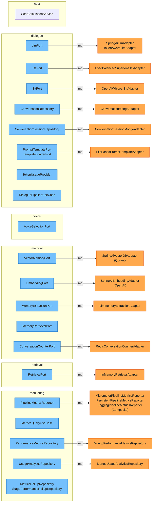
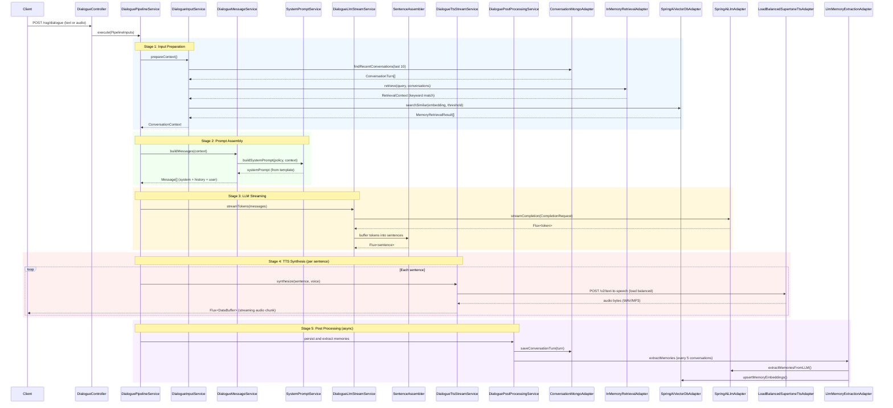
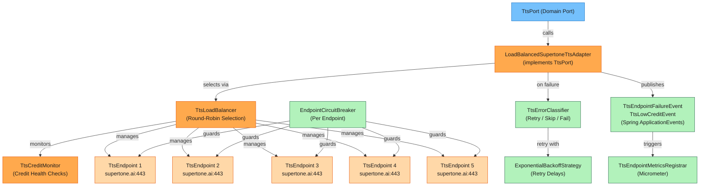

# MIYOU 헥사고날 아키텍처 구조도

현재 구현된 `webflux-dialogue` 모듈의 헥사고날(포트-어댑터) 아키텍처를 시각화한 문서입니다.
리팩토링 진행 현황은 [hexagonal-architecture-refactoring](../hexagonal-architecture-refactoring/README.md)을 참고하세요.

---

## 1. 개요

### 아키텍처 원칙

| 원칙 | 설명 |
|------|------|
| Dependency Inversion | 모든 의존성은 Infrastructure → Application → Domain 방향으로만 흐른다 |
| Port-Adapter Pattern | Domain이 선언한 Port(인터페이스)를 Infrastructure Adapter가 구현한다 |
| Framework Independence | Domain 레이어는 Spring, MongoDB, Micrometer 등 외부 프레임워크에 의존하지 않는다 |
| Reactive First | 모든 I/O는 `Mono`/`Flux`를 사용하며 블로킹 호출을 금지한다 |

### 레이어 요약

| 레이어 | 파일 수 | 역할 |
|--------|---------|------|
| Domain | 63 | 순수 비즈니스 로직, 포트 인터페이스, 도메인 모델 |
| Application | 27 | 유스케이스 오케스트레이션, 파이프라인 구현, AOP 모니터링 |
| Infrastructure | 85 | REST 컨트롤러, 외부 시스템 어댑터, Spring 설정 |

---

## 2. 레이어 의존성 구조도

```mermaid
graph TB
    subgraph INF["Infrastructure Layer (85 files)"]
        direction TB
        CTRL["Inbound Controllers\nDialogueController\nConversationSessionController\nMetricsController\nDashboardController"]
        ADAPT_LLM["LLM Adapter\nSpringAiLlmAdapter\nTokenAwareLlmAdapter"]
        ADAPT_TTS["TTS Adapter\nLoadBalancedSupertoneTtsAdapter\nTtsLoadBalancer"]
        ADAPT_STT["STT Adapter\nOpenAiWhisperSttAdapter"]
        ADAPT_MEM["Memory Adapters\nSpringAiVectorDbAdapter\nSpringAiEmbeddingAdapter\nRedisConversationCounterAdapter\nLlmMemoryExtractionAdapter"]
        ADAPT_RETR["Retrieval Adapter\nInMemoryRetrievalAdapter"]
        ADAPT_DB["Persistence Adapters\nConversationMongoAdapter\nConversationSessionMongoAdapter"]
        ADAPT_MON["Monitoring Adapters\nMicrometerPipelineMetricsReporter\nPersistentPipelineMetricsReporter\nMongoUsageAnalyticsRepository"]
        CFG["Configuration\nRagDialogueProperties\nDialoguePolicyConfiguration\n13x MonitoringConfiguration"]
    end

    subgraph APP["Application Layer (27 files)"]
        direction TB
        PIPE["Dialogue Pipeline\nDialoguePipelineService"]
        STAGE["Pipeline Stages\nDialogueInputService\nDialogueLlmStreamService\nDialogueMessageService\nDialogueTtsStreamService\nDialoguePostProcessingService\nSystemPromptService"]
        SVC_MEM["Memory Services\nMemoryExtractionService\nMemoryRetrievalService"]
        POLICY["Policies\nDialogueExecutionPolicy\nPromptTemplatePolicy\nSttPolicy\nMemoryExtractionPolicy"]
        MON_APP["Monitoring\nDialoguePipelineMonitor\nDialoguePipelineTracker\nPipelineTracer\nMetricsQueryService\nMonitoredPipelineAspect"]
    end

    subgraph DOM["Domain Layer (63 files)"]
        direction TB
        PORT_DLG["Dialogue Ports\nDialoguePipelineUseCase\nLlmPort / TtsPort / SttPort\nConversationRepository\nConversationSessionRepository"]
        PORT_MEM["Memory Ports\nVectorMemoryPort\nEmbeddingPort\nMemoryExtractionPort\nConversationCounterPort"]
        PORT_MON["Monitoring Ports\nPipelineMetricsReporter\nMetricsQueryUseCase\nPerformanceMetricsRepository\nUsageAnalyticsRepository"]
        PORT_RETR["Retrieval Port\nRetrievalPort"]
        MODELS["Domain Models\ndialogue / memory /\nretrieval / voice /\nmonitoring / cost"]
    end

    CTRL -->|calls| PIPE
    ADAPT_LLM -->|implements| PORT_DLG
    ADAPT_TTS -->|implements| PORT_DLG
    ADAPT_STT -->|implements| PORT_DLG
    ADAPT_MEM -->|implements| PORT_MEM
    ADAPT_RETR -->|implements| PORT_RETR
    ADAPT_DB -->|implements| PORT_DLG
    ADAPT_MON -->|implements| PORT_MON
    PIPE -->|implements| PORT_DLG
    PIPE -->|uses| STAGE
    PIPE -->|uses| SVC_MEM
    PIPE -->|uses| POLICY
    STAGE -->|calls| PORT_DLG
    STAGE -->|calls| PORT_MEM
    STAGE -->|calls| PORT_RETR
    MON_APP -->|calls| PORT_MON
    MON_APP -->|reads| MODELS

    classDef infra fill:#FFA94D,stroke:#E8590C,color:#1C1C1C
    classDef app fill:#74C69D,stroke:#2D6A4F,color:#1C1C1C
    classDef domain fill:#74C0FC,stroke:#1971C2,color:#1C1C1C

    class CTRL,ADAPT_LLM,ADAPT_TTS,ADAPT_STT,ADAPT_MEM,ADAPT_RETR,ADAPT_DB,ADAPT_MON,CFG infra
    class PIPE,STAGE,SVC_MEM,POLICY,MON_APP app
    class PORT_DLG,PORT_MEM,PORT_MON,PORT_RETR,MODELS domain
```



---

## 3. 도메인 서브도메인 구조도

6개 서브도메인의 포트와 어댑터 연결을 나타냅니다.



---

## 4. RAG 파이프라인 플로우



---

## 5. TTS 로드밸런서 구조



---

## 6. 전체 패키지 구조

```
com.study.webflux.rag/
│
├── RagApplication.java
│
├── domain/                                    # Domain Layer (63 files)
│   ├── cost/
│   │   ├── model/
│   │   │   ├── CostInfo.java
│   │   │   └── ModelPricing.java
│   │   └── service/
│   │       └── CostCalculationService.java
│   │
│   ├── dialogue/
│   │   ├── model/
│   │   │   ├── AudioTranscriptionInput.java
│   │   │   ├── CompletionRequest.java
│   │   │   ├── CompletionResponse.java
│   │   │   ├── ConversationContext.java
│   │   │   ├── ConversationSession.java
│   │   │   ├── ConversationSessionId.java
│   │   │   ├── ConversationTurn.java
│   │   │   ├── Message.java
│   │   │   ├── MessageRole.java
│   │   │   ├── PersonaId.java
│   │   │   ├── TokenUsage.java
│   │   │   └── UserId.java
│   │   ├── port/
│   │   │   ├── ConversationRepository.java
│   │   │   ├── ConversationSessionRepository.java
│   │   │   ├── DialoguePipelineUseCase.java
│   │   │   ├── LlmPort.java
│   │   │   ├── PromptTemplatePort.java
│   │   │   ├── SttPort.java
│   │   │   ├── TemplateLoaderPort.java
│   │   │   ├── TokenUsageProvider.java
│   │   │   └── TtsPort.java
│   │   └── service/
│   │       └── SentenceAssembler.java
│   │
│   ├── memory/
│   │   ├── model/
│   │   │   ├── ExtractedMemory.java
│   │   │   ├── Memory.java
│   │   │   ├── MemoryEmbedding.java
│   │   │   ├── MemoryExtractionContext.java
│   │   │   ├── MemoryRetrievalResult.java
│   │   │   └── MemoryType.java
│   │   └── port/
│   │       ├── ConversationCounterPort.java
│   │       ├── EmbeddingPort.java
│   │       ├── MemoryExtractionPort.java
│   │       ├── MemoryRetrievalPort.java
│   │       └── VectorMemoryPort.java
│   │
│   ├── monitoring/
│   │   ├── model/
│   │   │   ├── DialoguePipelineStage.java
│   │   │   ├── MetricsGranularity.java
│   │   │   ├── MetricsRollup.java
│   │   │   ├── PerformanceMetrics.java
│   │   │   ├── PipelineDetail.java
│   │   │   ├── PipelineStatus.java
│   │   │   ├── PipelineSummary.java
│   │   │   ├── StagePerformanceRollup.java
│   │   │   ├── StagePerformanceSummary.java
│   │   │   ├── StageSnapshot.java
│   │   │   ├── StageStatus.java
│   │   │   └── UsageAnalytics.java
│   │   └── port/
│   │       ├── MetricsQueryUseCase.java
│   │       ├── MetricsRollupRepository.java
│   │       ├── PerformanceMetricsRepository.java
│   │       ├── PipelineMetricsReporter.java
│   │       ├── StagePerformanceRollupRepository.java
│   │       └── UsageAnalyticsRepository.java
│   │
│   ├── retrieval/
│   │   ├── model/
│   │   │   ├── RetrievalContext.java
│   │   │   ├── RetrievalDocument.java
│   │   │   └── SimilarityScore.java
│   │   └── port/
│   │       └── RetrievalPort.java
│   │
│   └── voice/
│       ├── model/
│       │   ├── AudioFormat.java
│       │   ├── Voice.java
│       │   ├── VoiceSettings.java
│       │   └── VoiceStyle.java
│       └── port/
│           └── VoiceSelectionPort.java
│
├── application/                               # Application Layer (27 files)
│   ├── dialogue/
│   │   ├── pipeline/
│   │   │   ├── stage/
│   │   │   │   ├── DialogueInputService.java
│   │   │   │   ├── DialogueLlmStreamService.java
│   │   │   │   ├── DialogueMessageService.java
│   │   │   │   ├── DialoguePostProcessingService.java
│   │   │   │   ├── DialogueTtsStreamService.java
│   │   │   │   └── SystemPromptService.java
│   │   │   ├── DialoguePipelineService.java
│   │   │   └── PipelineInputs.java
│   │   ├── policy/
│   │   │   ├── DialogueExecutionPolicy.java
│   │   │   ├── PromptTemplatePolicy.java
│   │   │   └── SttPolicy.java
│   │   └── service/
│   │       └── DialogueSpeechService.java
│   │
│   ├── memory/
│   │   ├── policy/
│   │   │   ├── MemoryExtractionPolicy.java
│   │   │   └── MemoryRetrievalPolicy.java
│   │   └── service/
│   │       ├── MemoryExtractionService.java
│   │       └── MemoryRetrievalService.java
│   │
│   └── monitoring/
│       ├── aop/
│       │   ├── MonitoredPipeline.java
│       │   └── MonitoredPipelineAspect.java
│       ├── context/
│       │   └── PipelineContext.java
│       ├── monitor/
│       │   ├── DialoguePipelineMonitor.java
│       │   └── DialoguePipelineTracker.java
│       ├── port/
│       │   ├── ConversationMetricsPort.java
│       │   ├── MemoryExtractionMetricsPort.java
│       │   └── RagQualityMetricsPort.java
│       └── service/
│           ├── MetricsQueryService.java
│           ├── MetricsRollupScheduler.java
│           └── PipelineTracer.java
│
└── infrastructure/                            # Infrastructure Layer (85 files)
    ├── common/
    │   ├── config/
    │   │   ├── ClockConfig.java
    │   │   ├── OpenApiConfiguration.java
    │   │   └── WebFluxCorsConfiguration.java
    │   ├── constants/
    │   │   └── DialogueConstants.java
    │   └── template/
    │       ├── FileBasedPromptTemplate.java
    │       └── FileBasedPromptTemplateAdapter.java
    │
    ├── dialogue/
    │   ├── adapter/
    │   │   ├── llm/
    │   │   │   ├── SpringAiLlmAdapter.java
    │   │   │   └── TokenAwareLlmAdapter.java
    │   │   ├── persistence/
    │   │   │   ├── document/
    │   │   │   │   ├── ConversationDocument.java
    │   │   │   │   └── ConversationSessionDocument.java
    │   │   │   ├── ConversationMongoAdapter.java
    │   │   │   └── ConversationSessionMongoAdapter.java
    │   │   ├── stt/
    │   │   │   └── OpenAiWhisperSttAdapter.java
    │   │   └── tts/
    │   │       ├── loadbalancer/
    │   │       │   ├── circuit/
    │   │       │   │   ├── CircuitBreakerState.java
    │   │       │   │   ├── EndpointCircuitBreaker.java
    │   │       │   │   └── ExponentialBackoffStrategy.java
    │   │       │   ├── CreditResponse.java
    │   │       │   ├── TtsCreditMonitor.java
    │   │       │   ├── TtsEndpoint.java
    │   │       │   ├── TtsEndpointFailureEvent.java
    │   │       │   ├── TtsErrorClassifier.java
    │   │       │   ├── TtsLoadBalancer.java
    │   │       │   └── TtsLowCreditEvent.java
    │   │       ├── LoadBalancedSupertoneTtsAdapter.java
    │   │       ├── SupertoneConfig.java
    │   │       └── SupertoneTtsAdapter.java
    │   ├── config/
    │   │   ├── properties/
    │   │   │   └── RagDialogueProperties.java
    │   │   ├── DialoguePolicyConfiguration.java
    │   │   ├── DialogueVoiceConfiguration.java
    │   │   ├── DomainServiceConfiguration.java
    │   │   ├── PersonaVoiceProvider.java
    │   │   ├── SttConfiguration.java
    │   │   └── TtsConfiguration.java
    │   └── repository/
    │       ├── ConversationMongoRepository.java
    │       └── ConversationSessionMongoRepository.java
    │
    ├── inbound/
    │   └── web/
    │       ├── dialogue/
    │       │   ├── docs/
    │       │   │   └── DialogueApi.java
    │       │   ├── dto/
    │       │   │   ├── CreateSessionRequest.java
    │       │   │   ├── CreateSessionResponse.java
    │       │   │   ├── RagDialogueRequest.java
    │       │   │   ├── SttDialogueResponse.java
    │       │   │   └── SttTranscriptionResponse.java
    │       │   ├── ConversationSessionController.java
    │       │   └── DialogueController.java
    │       └── monitoring/
    │           ├── DashboardController.java
    │           └── MetricsController.java
    │
    ├── memory/
    │   ├── adapter/
    │   │   ├── LlmMemoryExtractionAdapter.java
    │   │   ├── MemoryExtractionConfig.java
    │   │   ├── MemoryExtractionDto.java
    │   │   ├── RedisConversationCounterAdapter.java
    │   │   ├── SpringAiEmbeddingAdapter.java
    │   │   └── SpringAiVectorDbAdapter.java
    │   └── config/
    │       ├── MemoryConfiguration.java
    │       └── QdrantCollectionInitializer.java
    │
    ├── monitoring/
    │   ├── adapter/
    │   │   ├── MongoMetricsRollupRepository.java
    │   │   ├── MongoPerformanceMetricsRepository.java
    │   │   ├── MongoStagePerformanceRollupRepository.java
    │   │   └── MongoUsageAnalyticsRepository.java
    │   ├── config/
    │   │   ├── ConversationMetricsConfiguration.java
    │   │   ├── CostTrackingMetricsConfiguration.java
    │   │   ├── HttpServerMetricsFilterConfiguration.java
    │   │   ├── LlmMetricsConfiguration.java
    │   │   ├── MemoryExtractionMetricsConfiguration.java
    │   │   ├── MonitoringConfiguration.java
    │   │   ├── PipelineMetricsConfiguration.java
    │   │   ├── RagQualityMetricsConfiguration.java
    │   │   ├── TtsBackpressureMetrics.java
    │   │   ├── TtsEndpointMetricsRegistrar.java
    │   │   ├── TtsMetricsConfiguration.java
    │   │   ├── TtsMonitoringEventListener.java
    │   │   └── UxMetricsConfiguration.java
    │   ├── document/
    │   │   ├── MetricsRollupDocument.java
    │   │   ├── PerformanceMetricsDocument.java
    │   │   ├── StagePerformanceRollupDocument.java
    │   │   └── UsageAnalyticsDocument.java
    │   ├── micrometer/
    │   │   ├── CompositePipelineMetricsReporter.java
    │   │   └── MicrometerPipelineMetricsReporter.java
    │   └── repository/
    │       ├── SpringDataMetricsRollupRepository.java
    │       ├── SpringDataPerformanceMetricsRepository.java
    │       ├── SpringDataStagePerformanceRollupRepository.java
    │       └── SpringDataUsageAnalyticsRepository.java
    │
    ├── outbound/
    │   └── monitoring/
    │       ├── LoggingPipelineMetricsReporter.java
    │       └── PersistentPipelineMetricsReporter.java
    │
    └── retrieval/
        └── adapter/
            ├── InMemoryRetrievalAdapter.java
            ├── KeywordSimilaritySupport.java
            └── VectorMemoryRetrievalAdapter.java
```
