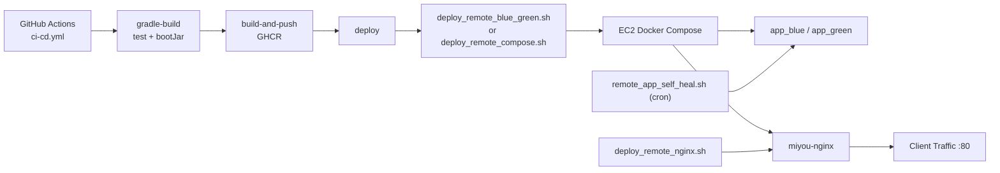
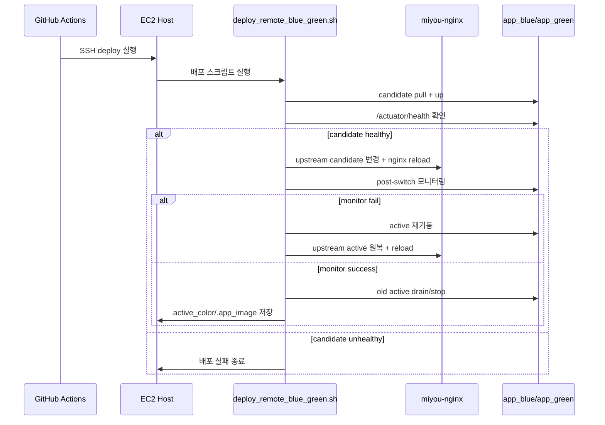

# Nginx + CI/CD 배포 모듈 기술 문서

## 1) Background and objective
- 목적: GitHub Actions 기반 배포 파이프라인과 EC2 Nginx/Blue-Green 운영 절차를 코드 기준으로 문서화
- 범위: `.github/workflows/ci-cd.yml`, `deploy/aws/deploy_remote_*.sh`, `deploy/nginx/default.conf`, `deploy/docker-compose.app.yml`
- 목표:
  - 배포 성공/실패 경로를 운영자가 예측 가능하도록 명확화
  - 장애 시 자동 복구 경로(롤백, self-heal) 정의
  - CI 캐시 최적화 포인트를 고정 표준으로 관리

## 2) Module structure (packages, responsibilities)
| 구성 요소 | 파일 | 책임 |
| --- | --- | --- |
| CI 오케스트레이션 | `.github/workflows/ci-cd.yml` | test/build/push/deploy/nginx-deploy/notify 잡 실행 |
| 배포 계약 검증 | `scripts/validate-deploy-contract.sh` | compose 경로/공통 함수 연결 정적 검증 |
| 슬롯 상태 점검 | `scripts/check-active-slot.sh` | marker/nginx-runtime/running 슬롯 기반 active 자동 판별 |
| Compose 계약 공통화 | `deploy/aws/remote_compose_contract.sh` | compose 경로 자동 해석/고정, env 동기화, 계약 검증 |
| Blue-Green 배포 | `deploy/aws/deploy_remote_blue_green.sh` | candidate 기동/헬스체크/트래픽 전환/롤백/드레인 |
| Rolling 배포 | `deploy/aws/deploy_remote_compose.sh` | active 슬롯 기준 pull/up 배포 |
| Nginx 단독 배포 | `deploy/aws/deploy_remote_nginx.sh` | nginx conf 반영, active 슬롯 정합성 보정 |
| Self-heal watchdog | `deploy/aws/remote_app_self_heal.sh` | blue/green 둘 다 down 시 active 슬롯 자동 복구 |
| Nginx 라우팅 | `deploy/nginx/default.conf` | `$app_upstream` 기반 프록시, 모니터링 경로 프록시 |
| 런타임 토폴로지 | `deploy/docker-compose.app.yml` | `app_blue/app_green/nginx/mongodb/redis/qdrant` 컨테이너 정의 |

현재 상태(Implemented):
- Blue-Green 전환 후 모니터링(`POST_SWITCH_MONITOR_SECONDS`) + `trap` 롤백
- Nginx 배포 시 `.active_color`와 실제 실행 슬롯 불일치 자동 보정
- `remote_app_self_heal.sh` + cron(1분 주기)로 이중 슬롯 다운 자동 복구
- compose 경로 계약 파일(`.compose_app_file`)로 root/deploy 경로 자동 호환
- blue-green/nginx 배포 시 nginx 컨테이너 재생성 대신 `nginx -s reload` 사용
- CI에서 Gradle/Buildx 캐시 최적화 적용

미래 상태(TODO):
- cron 기반 self-heal을 `systemd timer`로 전환
- remote 서버 상태를 Prometheus alert와 자동 연동

## 3) Runtime flow
### 3.1 Blue-Green 배포
1. active 슬롯 확인(`.active_color`)
2. candidate 슬롯 pull/up
3. candidate `/actuator/health` 확인
4. `default.conf` upstream candidate로 변경 후 `nginx -t && reload`
5. post-switch 모니터링
6. 실패 시 `trap` 롤백(active 재기동 + upstream 원복)
7. 성공 시 기존 active drain/stop 후 `.active_color` 갱신

### 3.2 Nginx 단독 배포
1. `.active_color` 기준 active 슬롯 계산
2. active 미실행 시 fallback 슬롯 탐색
3. 둘 다 미실행이면 active 슬롯 선기동 후 reload
4. `$app_upstream` 변수 기반 conf인지 검증 후 반영

### 3.3 Self-heal
1. cron이 매분 `remote_app_self_heal.sh` 실행
2. blue/green 실행 상태 확인
3. 둘 다 미실행이면 `.active_color` 슬롯 자동 기동
4. `.app_image`가 있으면 마지막 배포 이미지 우선 사용

## 4) Configuration contract
### 4.1 GitHub Secrets (`.github/workflows/ci-cd.yml`)
- `EC2_HOST`, `EC2_USER`, `EC2_SSH_PRIVATE_KEY`
- `GHCR_USERNAME`, `GHCR_TOKEN`
- `SSM_PATH`, `AWS_REGION`
- 선택: `DISCORD_WEBHOOK_URL`

### 4.2 배포 변수 (스크립트)
- `APP_IMAGE`: 배포 이미지 태그
- `USE_SSM`, `SSM_PATH`, `AWS_REGION`
- `DRAIN_SECONDS`, `STOP_TIMEOUT_SECONDS`, `POST_SWITCH_MONITOR_SECONDS`
- `REMOTE_DIR` (기본 `/opt/app/miyou`)

### 4.3 런타임 상태 파일 (원격 서버)
- `.active_color`: 현재 active 슬롯 (`blue|green`)
- `.app_image`: 마지막 성공 배포 이미지 태그
- `.compose_app_file`: app compose 기준 경로(`docker-compose.app.yml` 또는 `deploy/docker-compose.app.yml`)
- `deploy/nginx/.htpasswd`: Basic Auth 파일

### 4.4 Compose/Env 경로 계약
- compose 파일은 원격 서버에 두 경로로 동기화한다.
  - `/opt/app/miyou/docker-compose.app.yml` (표준)
  - `/opt/app/miyou/deploy/docker-compose.app.yml` (legacy 호환)
- compose 실행 경로 우선순위:
  1. `.compose_app_file`에 저장된 경로
  2. 기존 컨테이너의 `com.docker.compose.project.config_files` 라벨에서 감지한 경로
  3. 기본값 `docker-compose.app.yml`
- env 파일은 `/opt/app/miyou/.env.deploy`를 기준으로 생성하고, `deploy/.env.deploy`로 동기화한다.

### 4.5 CI 캐시 계약
- Gradle: `--build-cache` + `gradle.properties(org.gradle.caching=true)`
- Docker Buildx: `cache-from/to type=gha,scope=miyou-dialogue-image`
- `webflux-dialogue/Dockerfile`: BuildKit 캐시 마운트(`/home/gradle/.gradle`)

## 5) Extension/migration strategy
- self-heal 고도화:
  - cron -> `systemd timer` 전환
  - 실패 횟수/최근 복구 이벤트를 메트릭으로 노출
- 배포 전략 고도화:
  - Blue-Green canary 전환 비율 도입(nginx weighted upstream)
  - rollback 사유별 알림 템플릿 분리
- 보안/운영 고도화:
  - SSH 기반 배포를 SSM Session Manager 중심으로 점진 전환
  - Nginx/Grafana 접근 정책을 CIDR + OIDC 연계 방식으로 강화

## 6) Review checklist
- [ ] `.github/workflows/ci-cd.yml` 단계/조건과 문서가 일치하는가
- [ ] `deploy_remote_blue_green.sh` 롤백 경로와 설명이 일치하는가
- [ ] `deploy_remote_nginx.sh` fallback/선기동 로직이 반영되어 있는가
- [ ] `remote_app_self_heal.sh`와 cron 설치 절차가 반영되어 있는가
- [ ] `deploy/nginx/default.conf`가 `$app_upstream` 기반인지 확인했는가
- [ ] `scripts/validate-deploy-contract.sh`가 배포 이전 단계에서 실행되는가
- [ ] `.compose_app_file`/`deploy/.env.deploy` 계약이 문서와 스크립트에서 일치하는가
- [ ] 캐시 정책(Gradle/Buildx/Dockerfile) 변경 시 본 문서를 갱신했는가
