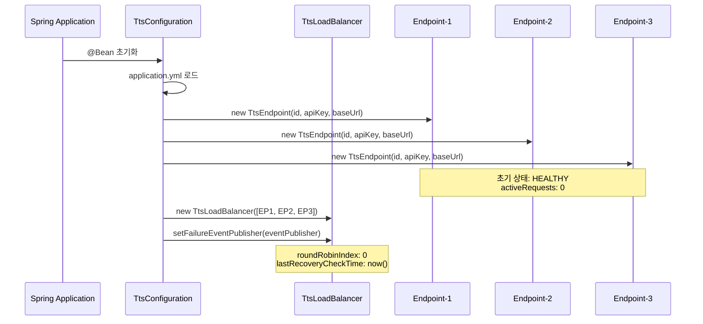
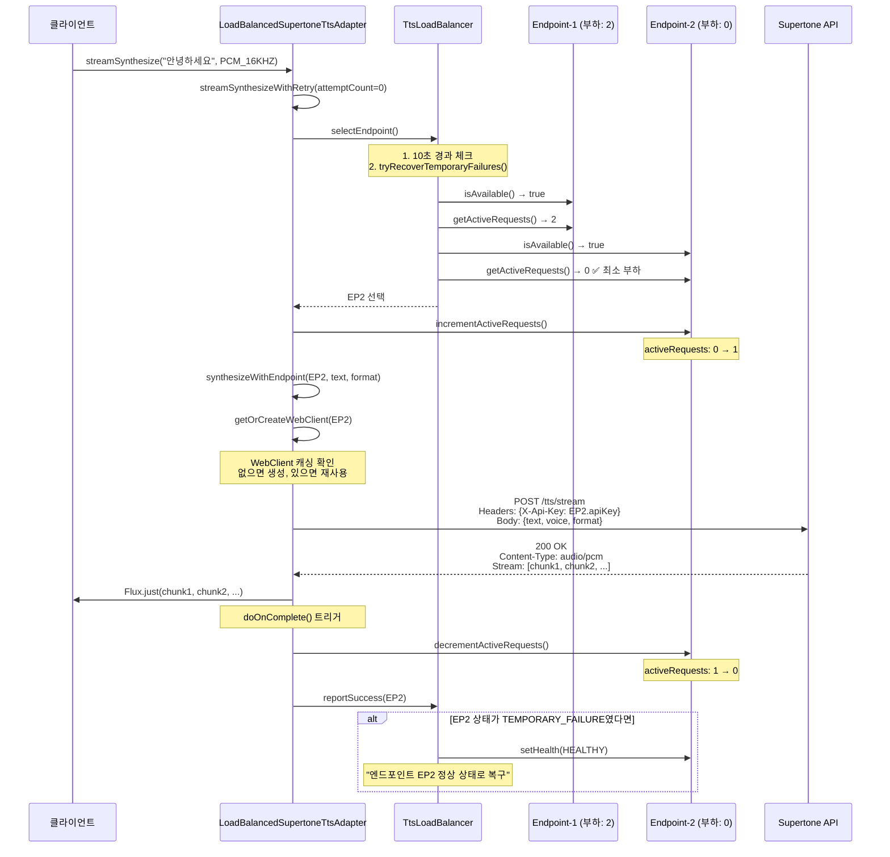
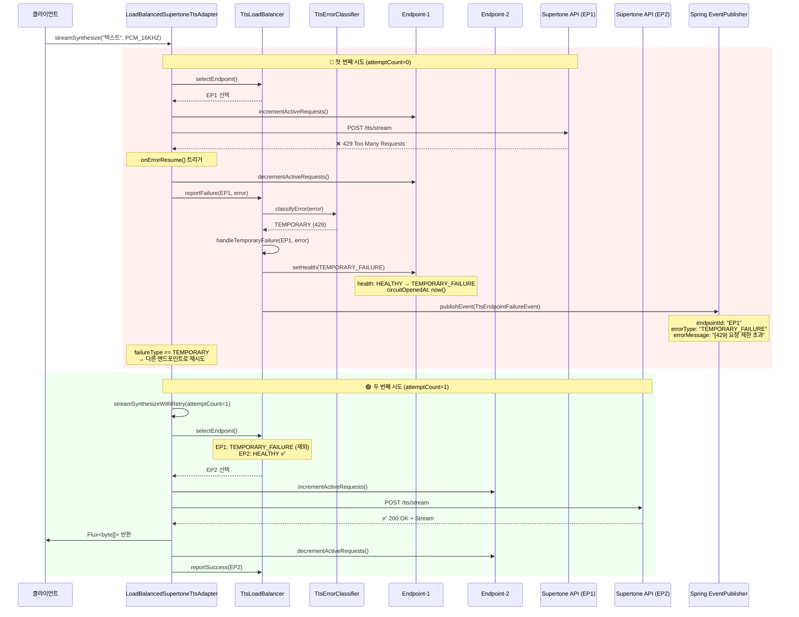
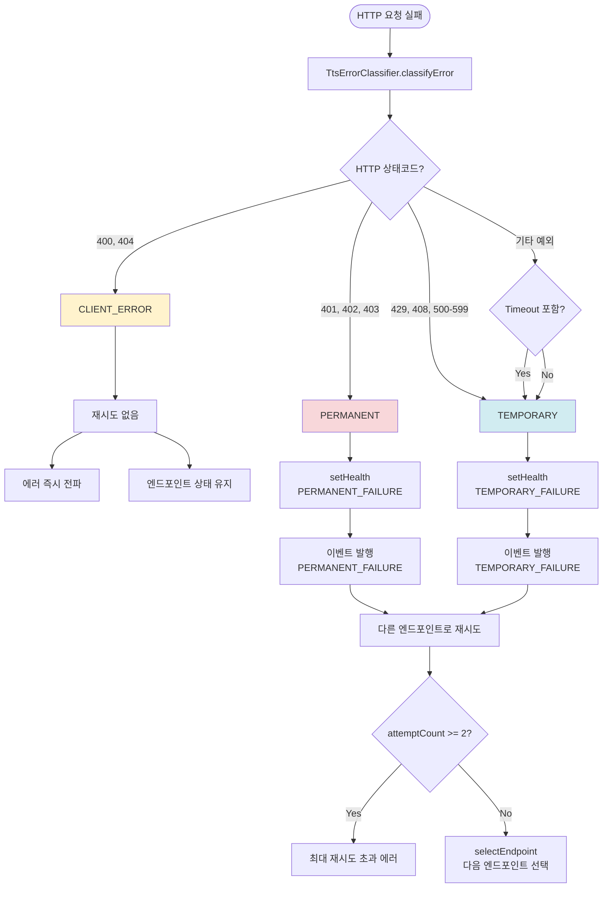
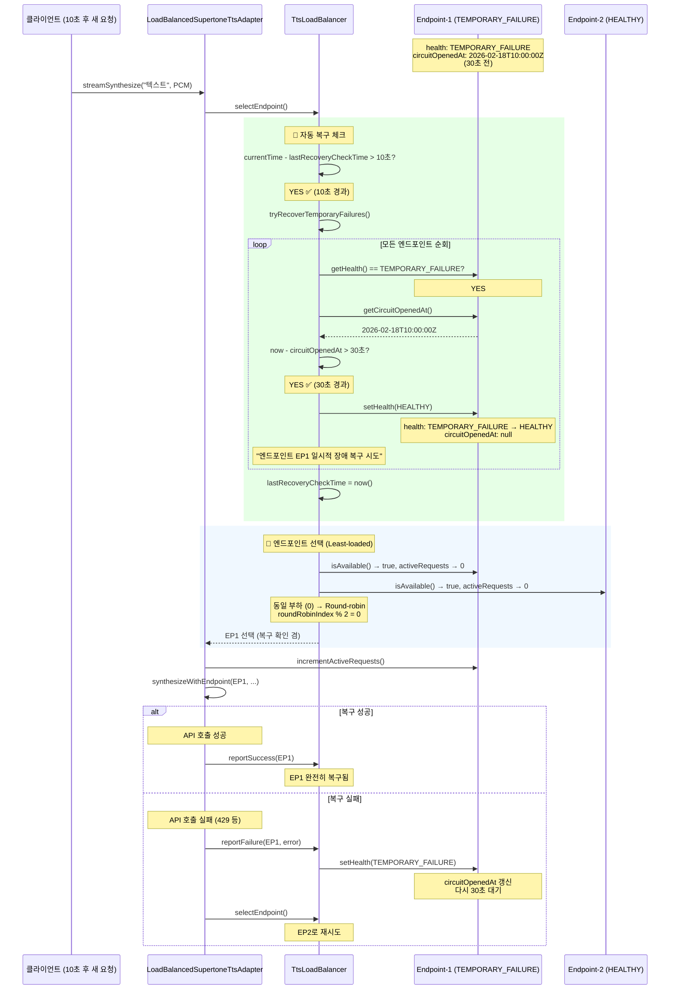
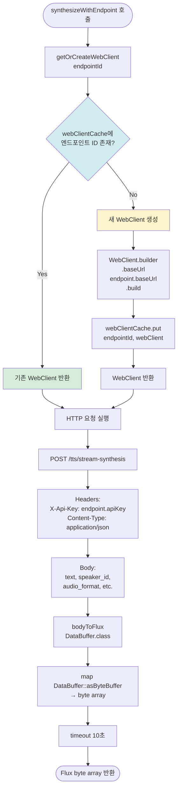
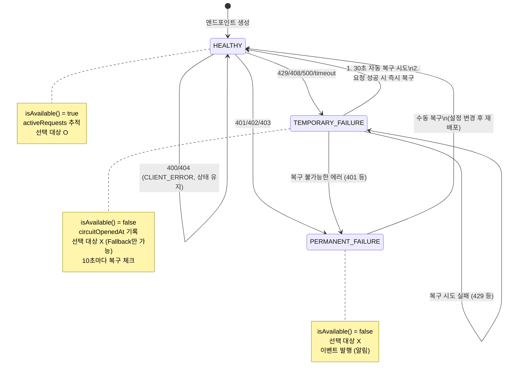
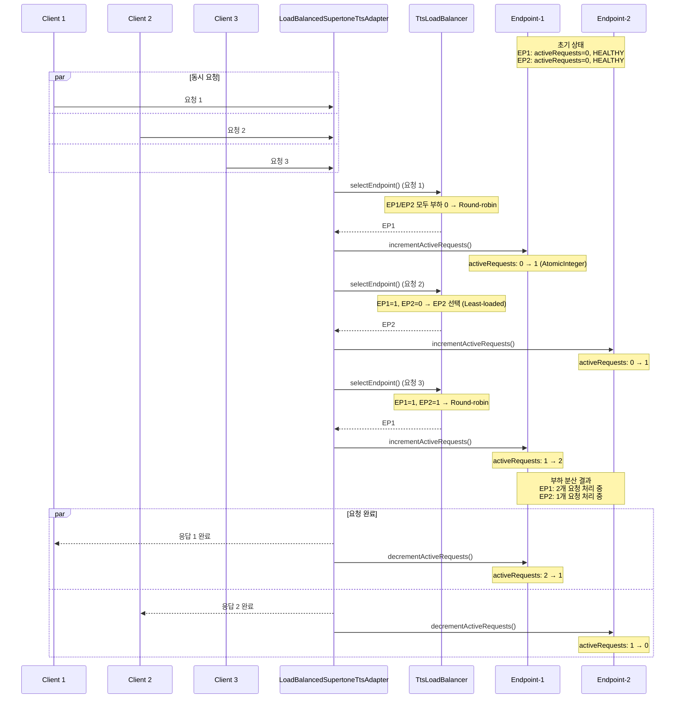

# TTS API Load Balancing

## 개요

TTS API의 rate limit 및 quota 제한을 우회하기 위해 다중 API 키를 사용한 로드 밸런싱 시스템 구현.

## 로드 밸런싱 전략

### 1. Health-aware
- 비정상 상태의 endpoint 자동 제외
- 30초 주기로 일시적 장애 복구 시도
- 10초 주기로 복구 체크 (성능 최적화)

### 2. Least-loaded
- 활성 요청 수가 가장 적은 endpoint 우선 선택
- 실시간 부하 추적 (AtomicInteger)

### 3. Round-robin
- 동일 부하일 때 순차 분배
- Lock-free 구현 (AtomicInteger index)

## 에러 분류 및 처리

### HTTP 상태 코드 기반 분류

**일시적 에러 (TEMPORARY)**
- 429 Too Many Requests (요청 제한 초과)
- 408 Request Timeout (타임아웃)
- 500+ Server Error (서버 내부 오류)
- 처리: 즉시 다른 엔드포인트로 재시도 (최대 2회)

**영구 장애 (PERMANENT)**
- 401 Unauthorized (인증 실패)
- 402 Not Enough Credits (크레딧 부족)
- 403 Forbidden (권한 없음)
- 처리: 다른 엔드포인트로 재시도 후 영구 비활성화 + 이벤트 발행

**클라이언트 에러 (CLIENT_ERROR)**
- 400 Bad Request (잘못된 요청)
- 404 Not Found (리소스 없음)
- 처리: 재시도 없이 즉시 에러 전파

### Endpoint Health States
- `HEALTHY`: 정상 작동
- `TEMPORARY_FAILURE`: 일시적 장애 (429, 408, 500 등)
- `PERMANENT_FAILURE`: 영구 장애 (401, 402, 403 등)
- `CLIENT_ERROR`: 클라이언트 에러 (400, 404 등)

## 복구 전략

### 일시적 장애 복구
- 30초 후 자동 복구 시도
- 요청 성공 시 즉시 HEALTHY 상태로 전환
- 다른 정상 엔드포인트로 즉시 요청 전환

### 영구 장애 복구
- 자동 복구 시도 없음 (수동 개입 필요)
- 장애 이벤트 발행으로 개발자에게 알림
- 다른 정상 엔드포인트로 즉시 요청 전환

### 클라이언트 에러
- 복구 시도 없음
- 에러를 호출자에게 즉시 전파

## 재시도 정책

### 자동 재시도
- 최대 재시도 횟수: 2회 (총 2번 시도)
- 일시적 에러/영구 장애: 다른 엔드포인트로 즉시 재시도
- 클라이언트 에러: 재시도 없이 즉시 실패
- 모든 엔드포인트 실패 시: "모든 TTS 엔드포인트 요청 실패" 에러 반환

### 타임아웃
- TTS 스트리밍 요청: 10초
- 엔드포인트 준비(warmup): 2초

## 장애 알림

### 영구 장애 이벤트
영구 장애(401, 402, 403) 발생 시 `TtsEndpointFailureEvent` 발행:
```java
TtsEndpointFailureEvent {
  endpointId: "endpoint-1"
  errorType: "PERMANENT_FAILURE"
  errorMessage: "[402] 크레딧 부족"
  occurredAt: 2025-01-15T10:30:00Z
}
```

현재는 System.err로 로깅되며, 향후 이벤트 드리븐 시스템(Kafka, SNS 등)과 연동 가능.

## 설정

```yaml
supertone:
  endpoints:
    - id: endpoint-1
      api-key: ${SUPERTONE_API_KEY_1}
      base-url: https://supertoneapi.com
    - id: endpoint-2
      api-key: ${SUPERTONE_API_KEY_2}
      base-url: https://supertoneapi.com
    - id: endpoint-3
      api-key: ${SUPERTONE_API_KEY_3}
      base-url: https://supertoneapi.com
```

## 성능 최적화

### WebClient 재사용
- Endpoint별 WebClient 인스턴스 캐싱 (ConcurrentHashMap)
- Connection pool 재사용으로 지연시간 감소

### 알고리즘 최적화
- 스트림 연산 O(3n) → 단일 루프 O(n)
- 복구 체크 주기 제한 (10초)
- 불필요한 timestamp 연산 제거

### 성능 영향
- WebClient 생성 오버헤드 제거: ~50ms → 0ms
- 로드 밸런싱 선택 시간: ~100μs → ~10μs
- 메모리: 중간 List 객체 생성 제거

## 모니터링

### 로그 메시지
엔드포인트 선택 및 상태 추적:
```
엔드포인트 endpoint-2 선택, 활성 요청 수: 3, 시도 횟수: 1
엔드포인트 endpoint-1 일시적 장애: [429] 요청 제한 초과
엔드포인트 endpoint-1 일시적 장애 복구 시도
엔드포인트 endpoint-2 영구 장애: [402] 크레딧 부족
엔드포인트 endpoint-3 장애로 다른 엔드포인트로 재시도 (2회차)
클라이언트 에러 발생, 재시도 없이 즉시 실패: [400] 잘못된 요청
```

### 장애 시나리오별 동작

**시나리오 1: 일시적 에러 (429)**
1. endpoint-1에서 429 에러 발생
2. endpoint-1을 TEMPORARY_FAILURE로 표시
3. endpoint-2로 즉시 재시도
4. 30초 후 endpoint-1 자동 복구 시도

**시나리오 2: 영구 장애 (402)**
1. endpoint-1에서 402 에러 발생
2. endpoint-1을 PERMANENT_FAILURE로 표시
3. 장애 이벤트 발행 (개발자 알림)
4. endpoint-2로 즉시 재시도
5. endpoint-1은 수동 복구 필요

**시나리오 3: 클라이언트 에러 (400)**
1. endpoint-1에서 400 에러 발생
2. endpoint-1을 CLIENT_ERROR로 표시
3. 재시도 없이 즉시 에러 반환

**시나리오 4: 모든 엔드포인트 다운**
1. endpoint-1 실패 → endpoint-2로 재시도
2. endpoint-2 실패 → 최대 재시도 횟수 초과
3. "모든 TTS 엔드포인트 요청 실패" 에러 반환

## 알려진 취약점 및 개선 포인트

> **분석일**: 2026-02-15
> **분석 대상**: TtsLoadBalancer, TtsEndpoint, TtsErrorClassifier, LoadBalancedSupertoneTtsAdapter

### 1. ~~전체 장애 시 Fallback 취약점~~ ✅ 수정됨

**상태**: 🟢 해결됨 (2026-02-15)

**수정 내용**:
- HEALTHY 엔드포인트가 없을 때 TEMPORARY_FAILURE 우선 선택 (복구 가능성)
- 모든 엔드포인트가 PERMANENT_FAILURE인 경우 `IllegalStateException` 발생
- 명확한 에러 메시지로 운영자에게 알림

**수정된 코드**:
```java
private TtsEndpoint selectFallbackEndpoint() {
    // TEMPORARY_FAILURE 엔드포인트 우선 선택
    for (TtsEndpoint endpoint : endpoints) {
        if (endpoint.getHealth() == EndpointHealth.TEMPORARY_FAILURE) {
            return endpoint;
        }
    }
    // 모든 엔드포인트가 PERMANENT_FAILURE인 경우
    throw new IllegalStateException("사용 가능한 TTS 엔드포인트가 없습니다.");
}
```

---

### 2. ~~Health/CircuitOpenedAt Race Condition~~ ✅ 수정됨

**상태**: 🟢 해결됨 (2026-02-15)

**수정 내용**:
- `synchronized` 블록으로 `health`와 `circuitOpenedAt` 원자적 업데이트 보장

**수정된 코드**:
```java
public void setHealth(EndpointHealth health) {
    synchronized (healthLock) {
        this.health = health;
        if (health == EndpointHealth.TEMPORARY_FAILURE || ...) {
            this.circuitOpenedAt = Instant.now();
        } else if (health == EndpointHealth.HEALTHY) {
            this.circuitOpenedAt = null;
        }
    }
}
```

---

### 3. ~~CLIENT_ERROR 상태 처리 불일치~~ ✅ 수정됨

**상태**: 🟢 해결됨 (2026-02-15)

**수정 내용**:
- CLIENT_ERROR(400/404)는 클라이언트 요청 문제이므로 엔드포인트 상태를 변경하지 않음
- 다음 정상 요청은 해당 엔드포인트에서 정상 처리 가능

**수정된 코드**:
```java
private void handleClientError(TtsEndpoint endpoint, Throwable error) {
    String description = getErrorDescription(error);
    log.warn("클라이언트 에러 발생 (엔드포인트 {} 상태 유지): {}", endpoint.getId(), description);
    // 엔드포인트 상태를 변경하지 않음
}
```

---

### 4. ~~요청 취소 시 ActiveRequests 누수~~ ✅ 수정됨

**상태**: 🟢 해결됨 (2026-02-15)

**수정 내용**:
- `doOnCancel()` 콜백 추가로 요청 취소 시에도 카운트 감소 보장
- 부하 측정 정확성 유지

**수정된 코드**:
```java
return synthesizeWithEndpoint(endpoint, text, format)
    // 클라이언트가 요청을 취소해도 activeRequests 카운트가 정확히 유지되도록 doOnCancel 추가
    .doOnCancel(() -> {
        endpoint.decrementActiveRequests();
        log.debug("엔드포인트 {} 요청 취소됨", endpoint.getId());
    })
    .doOnComplete(() -> { ... })
    .onErrorResume(error -> { ... });
```

---

### 5. ~~Warmup 실패 시 상태 미반영~~ ✅ 수정됨

**상태**: 🟢 해결됨 (2026-02-15)

**수정 내용**:
- Warmup 실패 시 `TEMPORARY_FAILURE`로 표시
- 첫 실제 요청에서 불필요한 실패 방지 (다른 엔드포인트 우선 사용)
- 30초 후 자동 복구 시도

**수정된 코드**:
```java
.doOnError(error -> {
    // Warmup 실패 시 TEMPORARY_FAILURE로 표시하여 첫 실제 요청에서 불필요한 실패 방지
    log.warn("엔드포인트 {} warmup 실패, TEMPORARY_FAILURE로 표시", endpoint.getId());
    endpoint.setHealth(TtsEndpoint.EndpointHealth.TEMPORARY_FAILURE);
})
```

---

### 취약점 요약 테이블

| # | 취약점 | 상태 | 심각도 | 영향 |
|---|--------|------|--------|------|
| 1 | 전체 장애 시 Fallback | ✅ 수정됨 | - | - |
| 2 | Health/CircuitOpenedAt Race | ✅ 수정됨 | - | - |
| 3 | CLIENT_ERROR 처리 | ✅ 수정됨 | - | - |
| 4 | ActiveRequests 누수 | ✅ 수정됨 | - | - |
| 5 | Warmup 실패 미반영 | ✅ 수정됨 | - | - |

---

## 아키텍처

### 주요 컴포넌트
- `TtsLoadBalancer`: 로드 밸런싱 및 복구 로직
- `TtsEndpoint`: Endpoint 상태 관리
- `TtsErrorClassifier`: HTTP 상태 코드 기반 에러 분류
- `TtsEndpointFailureEvent`: 영구 장애 이벤트
- `LoadBalancedSupertoneTtsAdapter`: TtsPort 구현체 (재시도 로직)
- `TtsConfiguration`: Spring Bean 설정

---

## 전체 동작 흐름

### 1. 시스템 초기화 (Application Startup)



---

### 2. 실제 요청 처리 흐름 (Happy Path)



---

### 3. 에러 발생 및 재시도 흐름



---

### 4. 에러 타입별 처리 분기



---

### 5. 자동 복구 메커니즘



---

### 6. WebClient 캐싱 및 Connection Pool 재사용



---

### 7. 엔드포인트 상태 전이도 (State Machine)



---

### 8. 동시 요청 처리 (Concurrency)



---

### 에러 처리 흐름 (요약)
```
HTTP 요청 실패
    ↓
TtsErrorClassifier.classifyError()
    ↓
┌─────────────┬─────────────┬─────────────┐
│  TEMPORARY  │  PERMANENT  │CLIENT_ERROR │
└─────────────┴─────────────┴─────────────┘
      ↓              ↓              ↓
  30초 후 복구    이벤트 발행    즉시 전파
      ↓              ↓              ↓
  다른 엔드포인트로 재시도 (최대 2회)
```
